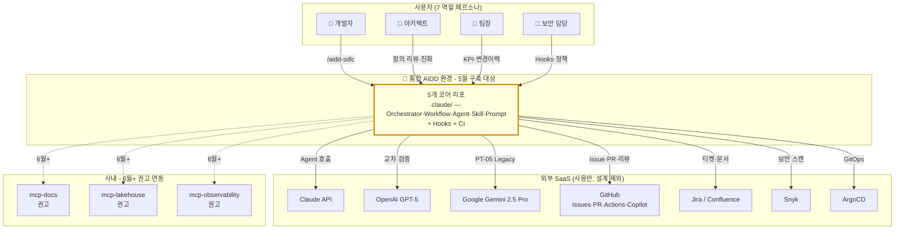
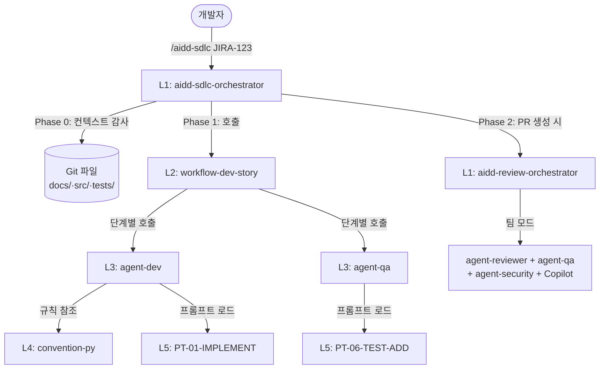
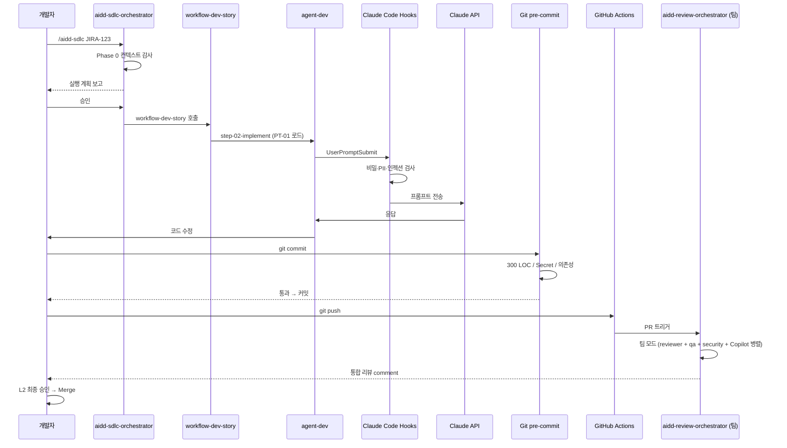
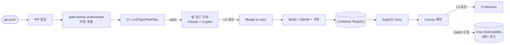
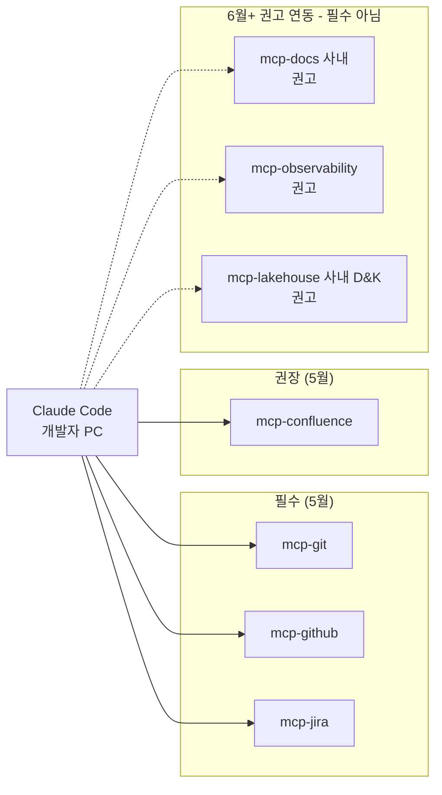

# 소프트웨어 아키텍처 — 통합 AIDD 환경 (2026년 5월)

> **문서 종류**: 아키텍처 설계서 (실무형, C4 + Harness 오케스트레이션 패턴 차용)
> **상위 문서**:
> - [AIDD_2026_진행계획.md](AIDD_2026_%EC%A7%84%ED%96%89%EA%B3%84%ED%9A%8D.md)
> - [AIDD_2026_05월_PRD.md](AIDD_2026_05%EC%9B%94_PRD.md)
> **근거 PDF**: 기술 상세 PDF — [(261419) AIDD End-to-End Process](AXSolutionDevelopment-%28261419%29%20AIDD%20End-to-End%20Process-200426-043710.pdf)
> **외부 참조**:
> - [BMAD-METHOD](https://github.com/bmad-code-org/BMAD-METHOD) — Agent-as-Skill 패턴, Workflow 번들 구조
> - [Harness](https://github.com/revfactory/harness) — 오케스트레이터 패턴, 6 아키텍처 패턴, 진화 메커니즘
> - **OpenAI Agentic Coding** — 4 선언 + 3 기둥 철학 (§0.5 참조)
> **담당 조직**: AX솔루션기획팀
> **작성일**: 2026-04-20
> **상태**: v3.7 (구현 결과 반영, 2026-04-21)

---

## 0.5 기반 철학 — OpenAI Agentic Coding 4선언 + 3기둥

본 아키텍처의 **근본 원리**. 5계층 구조·BMAD·Harness 차용은 **구현 수단**이고, 아래 철학은 **왜 그런 구조를 선택했나**의 근거.

### 0.5.1 4개 선언 (Agentic Coding의 최소 전제)

| # | 선언 | 본 아키텍처 구현 |
|---|---|---|
| 1 | **AGENTS.md 업무지침서** (해도됨/절대안됨) | **3개 포맷**: CLAUDE.md · AGENTS.md · .cursorrules (ADR-004) + AI Usage Rules 5개 + HITL L1/L2/L3 |
| 2 | **CI 게이트** (저장 시 자동 테스트) | 3중 방어: Claude Code Hooks + pre-commit + GitHub Actions (ADR-005) |
| 3 | **도구 경계** (AI 권한 사전 설정) | Hooks 7개 정책 (FR-9) + Subagent `allowed-tools` + MCP 필수 3종 제한 |
| 4 | **피드백 루프** (코딩→리뷰→규칙 보강→반복) | 진화 메커니즘(ADR-015) + 재귀 품질 방어(ADR-016~018) + Flywheel(S044) |

### 0.5.2 3 기둥 (운영 철학)

#### 기둥 1: **컨텍스트 파일 — Lean, 증분 추가**
- **원칙**: CLAUDE.md 리포 루트는 **60줄 이내**, 항상 적용되는 규칙만
- **세부는 분리**: `.claude/docs/*.md` (세션 시작 시 자동 로드 X, 필요 시 참조)
- **증분 추가**: 처음부터 완벽 불필요. **실패할 때마다 한 줄씩 추가** → 재발 방지
- **효과**: 컨텍스트 윈도우 공공재 보호, 신규 개발자 온보딩 부담 완화
- **ADR-019**, Story **S045**

#### 기둥 2: **자동 강제 시스템 — 조용한 성공, 시끄러운 실패**
- **린트**: 규칙 위반 시 자동 에러 (ruff·biome·eslint·Checkstyle)
- **프리커밋 훅**: 커밋 차단 (300 LOC·Secret·PII)
- **자동 교정 루프**: 린트 실패 → **Agent 자체 수정** → 사람 개입 최소화 (최대 N회 반복)
- **조용한 성공·시끄러운 실패**: 4000줄 통과 결과 표시 안 함, **실패만 명확 경보**
- **ADR-020**, Story **S046**

#### 기둥 3: **가비지 컬렉션 — 주기적 청소 Agent**
- **신규 Agent**: **`agent-janitor` (🧹 청소부)** — Agent 7종 → **8종**으로 확장
- **주기적 작업**:
  - 문서가 실제 코드와 달라졌는지 (docs ↔ src 정합성)
  - 규칙 위반 코드가 새로 생겼는지 (AI Usage Rules 스캔)
  - 사용하지 않는 코드·파일이 쌓였는지 (dead code·unused imports)
- **진화 트리거**: 실패 발견 → 새 규칙 1줄 추가 → 하네스 진화 → 점점 정교해짐
- **ADR-021**, Story **S047**

### 0.5.3 4개 선언 × 3 기둥 매트릭스

| | 선언1 AGENTS.md | 선언2 CI 게이트 | 선언3 도구 경계 | 선언4 피드백 |
|---|---|---|---|---|
| **기둥1 Lean 컨텍스트** | 60줄 원칙 (S045) | — | — | 실패→한 줄 추가 |
| **기둥2 자동 강제** | AI Usage Rules 강제 | Self-healing (S046) | Hook 자동 차단 | 조용한 성공 (S048) |
| **기둥3 가비지 컬렉션** | 규칙 위반 청소 | janitor 주간 실행 | 미사용 도구 감지 | 진화→규칙 증분 (S047) |

### 0.5.4 왜 이 철학인가

OpenAI가 **"4개 선언만으로 코딩 없이 개발"** 을 시연한 방식. 핵심 통찰:
1. **AI는 지침이 있으면 스스로 결정할 수 있다** — 지침이 불명확하면 추측으로 채움 (재귀 품질 문제, ADR-016)
2. **자동화가 없는 지침은 지켜지지 않는다** — 선언과 강제는 짝 (Hook·CI)
3. **시스템은 진화해야 한다** — 정적 산출물 아님 (ADR-015 하네스 진화)
4. **청소 없는 시스템은 부패한다** — 가비지 컬렉션 필수 (agent-janitor)

이 철학은 **사용자 R1·R2 요구와 정확히 일치**:
- R1 "기존 자료 읽고 반영" = 기둥3 가비지 컬렉션 + 기둥1 증분 원칙
- R2 "단계 복잡도 낮춤" = 기둥1 60줄 + 기둥2 조용한 성공

---

## 1. 아키텍처 스코프 & 전제

### 1.1 스코프
**대상**: 5개 코어 리포에 배포되는 **통합 AIDD 환경의 내부 구조** — `.claude/` 디렉터리, 오케스트레이터·Workflow·Agent·Skill·Prompt 5계층, Hooks 실행 순서, CI/CD, MCP 연동.

**제외**:
- 외부 SaaS 자체 구조
- 운영 인프라 (대시보드·감사)
- 대화(Chat) 기반 Agent 생성 (6~8월 별도 트랙)
- Flywheel 자동 이벤트 파이프라인 (6월+)

### 1.2 아키텍처 전제

| ID | 전제 | 근거 |
|---|---|---|
| ASM-1 | Claude Code가 Anthropic API 직접 호출 (사내 LLM 프록시 없음) | 사용자 확정 |
| ASM-2 | 개발자 PC 외부 인터넷 접속 가능 (폐쇄망 아님) | 사용자 확정 |
| ASM-3 | CI는 GitHub Actions, 배포는 ArgoCD + Helm canary | 사용자 확정 |
| ASM-4 | 감사 로그는 리포 로컬 + GitHub Actions 로그로 충분 (SIEM 연동 없음) | 사용자 확정 |
| ASM-5 | **3도구 혼합 팀 지원** — Claude Code · Cursor · GitHub Copilot (IntelliJ Copilot 포함). Python/TS는 Claude Code 또는 Cursor, Java는 IntelliJ Copilot 우선 (PDF §4.1·§5.2 원문) | 진행계획 §1.1 v10 |
| ASM-6 | **3개 포맷 배포 필수** — `CLAUDE.md` · `AGENTS.md` · `.cursorrules` (PDF §5.2 "3개 포맷 유지") | ADR-004 |
| ASM-7 | 모든 에이전트 호출 시 모델은 작업 특성에 맞춰 선택 (§10.1) | 기술 상세 PDF §3 |
| ASM-8 | Agent = Skill 패턴 통합 (BMAD 차용) — Agent 정의도 `.claude/skills/agent-*/` 에 존재 | ADR-008 |

### 1.3 아키텍처 품질 속성 (우선순위)

1. **일관성 (Consistency)** — 5개 리포 간 동일 구조·규칙 (NFR-7)
2. **보안 (Security)** — 비밀·PII 외부 전송 0건 (NFR-5)
3. **가용성 (Availability)** — 외부 API 장애 시 수동 전환 가능
4. **관측성 (Observability)** — 모든 Agent 실행이 이벤트로 기록
5. **단순성 (Simplicity)** — 사용자 진입 장벽 낮음 (Workflow 평균 ≤5단계, Quick mode 제공)
6. **확장성 (Extensibility)** — 미래 도구·역할 추가 시 영향 최소
7. **진화성 (Evolvability)** — 피드백 루프로 구조 자체 개선 (Harness 차용)

---

## 2. Context Diagram (시스템 경계)



**핵심**
- 5월 스코프 = **리포 내부 5계층 자산** (`.claude/` 하위)
- 외부 SaaS는 소비만 — 설계 대상 아님
- 사내 MCP 3종(`mcp-docs`·`mcp-lakehouse`·`mcp-observability`)은 6월+ **권고 사항**(필수 아님, 사내 인프라 가용성·정책에 따라 선택적 도입)

---

## 3. 자산 5계층 (Agent-as-Skill 통합 모델)

### 3.1 계층 정의

| 층 | 역할 | 파일 위치 | 예시 |
|---|---|---|---|
| **L1 Orchestrator** | 팀 구성·Phase 조율·컨텍스트 감사 | `.claude/skills/<domain>-orchestrator/SKILL.md` | `aidd-sdlc-orchestrator`, `aidd-review-orchestrator` |
| **L2 Workflow** | 단일 도메인의 단계적 playbook | `.claude/skills/workflow-*/` (번들: SKILL.md + workflow.md + steps/ + template.md + checklist.md) | `workflow-dev-story`, `workflow-create-architecture` |
| **L3 Agent** | "누가" — 역할 페르소나, 원칙, 메뉴 | `.claude/skills/agent-*/SKILL.md` + `.claude/agents/<role>.md` (빌트인 매핑) | `agent-analyst`, `agent-pm`, `agent-architect` |
| **L4 Skill** | 공통 규칙·체크리스트·절차 | `.claude/skills/<name>/SKILL.md` | `convention-py`, `security-review`, `commit-guardrail` |
| **L5 Prompt** | 작업 단위 프롬프트 초안 (재사용) | `.claude/prompts/PT-NN-*.md` | `PT-01-IMPLEMENT-v1`, `PT-06-TEST-ADD-v1` |

### 3.2 계층 간 호출 관계



### 3.3 왜 5계층인가

- **L1 없이** — 개발자가 Workflow를 직접 호출해야 함 → Phase 0 감사·이어서 실행 기능 부재
- **L2 없이** — Agent가 단계 흐름을 직접 제어 → 재사용성 낮음, step 관리 어려움
- **L3 없이** — 공통 Skill만 있고 "누가 하나" 불명 → HITL 책임 소재 모호
- **L4 없이** — 코딩 컨벤션·보안 체크가 Agent·Workflow 안에 중복 → DRY 위반
- **L5 없이** — 프롬프트 초안을 매번 새로 작성 → 일관성 떨어짐

### 3.3a 통합 Skill 리스트 (Claude Code 관점 전체 19종)

Claude Code는 `.claude/skills/` 하위의 모든 `SKILL.md` 를 "Skill"로 인식한다. 본 아키텍처의 **L1~L4 전부 Skill 파일로 존재**하며, 각각 슬래시 명령(`/skill-name`)으로 호출 가능하다. (L5 Prompt는 `.claude/prompts/` 별도 디렉터리)

#### 5월 배포 대상 Skill 전체 (19종)

| # | 이름 (슬래시 명령) | 계층 | 카테고리 | 성격 | P | 용도 | Story |
|---|---|---|---|---|---|---|---|
| 1 | `/aidd-sdlc` | **L1** | Orchestrator | 진입점 | P0 | SDLC 메인 오케스트레이션 (Phase 0 감사 + Workflow 조율) | S034 |
| 2 | `/aidd-review` | **L1** | Orchestrator | 진입점 | P0 | PR 팀 모드 리뷰 조율 (GHA 자동 트리거) | S034 |
| 3 | `/workflow-create-prd` | L2 | Workflow 번들 | 3단계 | P1 | PRD 작성 (분석→작성→검증) | S035 |
| 4 | `/workflow-create-architecture` | L2 | Workflow 번들 | 5단계 | P0 | 아키텍처 작성 (Context→Decisions→Pattern→Structure→Validation) | S035 |
| 5 | `/workflow-create-story` | L2 | Workflow 번들 | 3단계 | P1 | Epic/Story 분해 (PRD/ADR 읽기→분해→AC 작성) | S035 |
| 6 | `/workflow-dev-story` | L2 | Workflow 번들 | 5단계 ⭐ | P0 | Story 구현 (Context→Implement→Test→Docs→Self-check) | S035 |
| 7 | `/workflow-code-review-adversarial` | L2 | Workflow 번들 | 3단계 | P0 | 코드 리뷰 (Blind Hunter → Edge Case → Acceptance Auditor) | S035 |
| 8 | `/convention-py` | L4 | 코딩 컨벤션 | Reference (자동) | P0 | ruff + mypy + bandit + Snyk | S021 |
| 9 | `/convention-ts` | L4 | 코딩 컨벤션 | Reference (자동) | P0 | biome + eslint + tsc + Snyk | S021 |
| 10 | `/convention-java` | L4 | 코딩 컨벤션 | Reference (자동) | P2 | SpotBugs + Checkstyle + PMD + Snyk (Java 이연) | S021 |
| 11 | `/commit-guardrail` | L4 | 거버넌스 | Reference (자동) | P0 | 300 LOC / 비밀·PII 금지 | S021 |
| 12 | `/review-checklist` | L4 | 리뷰 | Task | P0 | AI reviewer 이중 + 인간 승인 체크리스트 | S021 |
| 13 | `/deploy-procedure` | L4 | 배포 | Task | P1 | GHA + Helm/ArgoCD/Jib canary 절차 | S021 |
| 14 | `/security-review` | L4 | 보안 ⭐ | Task | P0 | OWASP LLM Top 10 자동 스캔 | S036 |
| 15 | `/code-review-adversarial` | L4 | 리뷰 (고급) ⭐ | Task | P0 | Blind Hunter + Edge Case + Acceptance Auditor (BMAD 차용) | S036 |
| 16 | `/create-architecture-checklist` | L4 | 아키텍처 ⭐ | Task | P1 | ADR 완성도 점검 | S036 |
| 17 | `/retrospective` | L4 | 운영 ⭐ | Task | P1 | 분기 회고 템플릿 (§8.4) | S036 |
| 18 | `/brainstorming` | L4 | 기획 ⭐ | Task | P2 | 아이디어 발산 (Forward Mode 대비) | S036 |
| 19 | `/pr-hygiene` | L4 | 거버넌스 ⭐ | Task | P1 | Conventional Commits·브랜치명·PR 제목 | S036 |

> **범례**: P0=필수 / P1=권장 / P2=선택·이연 가능 / ⭐=BMAD·Harness·OWASP 차용 신규
> **Reference**: Claude Code가 자동 로드 / **Task**: `/skill-name` 명시 호출 또는 Workflow가 참조

#### L3 Agent Skill (8종, 별도 분류)

Agent도 Skill 파일로 존재하지만, 일반적으로 **Workflow가 호출**하거나 Claude가 description 매칭으로 자동 활성화. 개발자가 직접 `/agent-*` 호출도 가능.

| # | 이름 (슬래시 명령) | 역할 | 주 모델 | Story |
|---|---|---|---|---|
| A1 | `/agent-analyst` | 🔍 분석가 | Sonnet 4.6 | S020 |
| A2 | `/agent-pm` | 📋 PM | Sonnet 4.6 | S020 |
| A3 | `/agent-architect` | 🏗️ 아키텍트 | Opus 4.7 + GPT-5 교차 | S020 |
| A4 | `/agent-dev` | 💻 개발자 | Sonnet 4.6 (Py/TS) / GPT-5 (Java) | S020 |
| A5 | `/agent-qa` | 🧪 QA | Sonnet 4.6 / GPT-5 | S020 |
| A6 | `/agent-reviewer` | 🔎 리뷰어 | Haiku 4.5 (diff) + Sonnet 4.6 (심화) | S020 |
| A7 | `/agent-deployer` | 🚀 배포 담당 | Haiku 4.5 / Sonnet 4.6 | S020 |
| A8 ⭐ | `/agent-janitor` | 🧹 청소부 (docs-code 정합성·규칙 위반·dead code) | Haiku 4.5 (주간) + Sonnet 4.6 (수정 제안) | **S047** |

#### L5 Prompt (7종, `.claude/prompts/` 별도)

Workflow step에서 로드되어 사용. 슬래시 명령 아님.

| # | 파일명 | 용도 | 담당 Agent |
|---|---|---|---|
| PT-01 | `PT-01-IMPLEMENT-v1.md` | 기본 구현 | agent-dev |
| PT-03 | `PT-03-REVIEWER-v1.md` | PR 리뷰 | agent-reviewer |
| PT-05 | `PT-05-LEGACY-UNDERSTAND-v1.md` | Legacy 이해 (Gemini 2.5 Pro 2M) | 공통 |
| PT-06 | `PT-06-TEST-ADD-v1.md` | 2차 방어선 — property-based·mutation·경계면 교차 | agent-qa |
| PT-07 | `PT-07-DOCS-v1.md` | 문서화 | 공통 |
| PT-09 | `PT-09-DEPS-UPDATE-v1.md` | 의존성 업데이트 | 공통 |
| PT-11 | `PT-11-DESIGN-v1.md` | Design 결정 | agent-architect |

#### 5월 배포 합계 (1개 리포 기준)

| 계층 | 파일 수 | 비고 |
|---|---|---|
| L1 Orchestrator | 2 | `.claude/skills/aidd-sdlc/`, `.claude/skills/aidd-review/` |
| L2 Workflow 번들 | 5 × (SKILL.md + workflow.md + steps/ + template.md + checklist.md) | 번들 파일 합계 약 30개 |
| L3 Agent | 8 | `.claude/skills/agent-*/SKILL.md` + `.claude/agents/*.md` 빌트인 매핑 |
| L4 Skill | 13 (또는 12, Java 이연 시) | `.claude/skills/<name>/SKILL.md` |
| L5 Prompt | 7 | `.claude/prompts/PT-NN-*.md` |
| **슬래시 명령 총합** | **19 + 8 Agent = 27종** | `/aidd-*`, `/workflow-*`, `/agent-*`, `/<skill-name>` |

**5개 리포 전체**: 위 × 5 ≈ **175+ 파일**

#### 이연·향후 추가 (6월+)

| 이름 | 계층 | 이유 |
|---|---|---|
| `/convention-java` 활성화 | L4 | Java Phase 2 (M6~M12) |
| `/a11y-check` | L4 | 프론트엔드 접근성 (WCAG) |
| `/license-check` | L4 | AI 생성 코드 라이선스 (법무 협의 후) |
| `/rework-analysis` | L4 | Flywheel S044 자동 분석 (6월+) |
| `/ktssp-artifact-check` | L4 | 사내 표준 산출물 (Phase 2) |

### 3.4 디렉터리 전체 구조 (리포 루트)

```
리포 루트/
├── CLAUDE.md                                # 전역 규칙 (최소 포인터 + 변경 이력) — Claude Code용
├── AGENTS.md                                # agents.md open standard (CLAUDE.md와 동일 규칙) — Copilot·AGENTS 지원 도구용
├── .cursorrules                             # Cursor 네이티브 포맷 (CLAUDE.md와 동일 규칙) — Cursor용
│
└── .claude/
    ├── agents/                              # 빌트인 타입 매핑 (Harness 원칙: 파일 존재 필수)
    │   ├── analyst.md        (빌트인: general-purpose)
    │   ├── pm.md
    │   ├── architect.md
    │   ├── dev.md
    │   ├── qa.md             (빌트인: general-purpose — Explore는 읽기 전용이라 QA 부적합)
    │   ├── reviewer.md
    │   ├── deployer.md
    │   └── janitor.md        (빌트인: general-purpose — 주간 cron 자동 실행, ADR-021)
    │
    ├── skills/
    │   │
    │   │── ━━━ L1 Orchestrator ━━━
    │   ├── aidd-sdlc-orchestrator/          # 메인 SDLC 조율
    │   │   ├── SKILL.md
    │   │   └── references/
    │   │       ├── phase0-audit.md          # 컨텍스트 감사 로직
    │   │       ├── execution-modes.md       # Quick/Standard/Full
    │   │       ├── architecture-patterns.md # 6 패턴 참고
    │   │       └── phase-selection-matrix.md
    │   ├── aidd-review-orchestrator/        # PR 이중 리뷰 팀 조율
    │   │   └── SKILL.md
    │   │
    │   │── ━━━ L2 Workflow (번들 5종) ━━━
    │   ├── workflow-create-prd/             # 3단계
    │   ├── workflow-create-architecture/    # 5단계
    │   ├── workflow-create-story/           # 3단계
    │   ├── workflow-dev-story/              # 5단계 ⭐ 가장 자주 사용
    │   └── workflow-code-review-adversarial/ # 3단계
    │
    │   │── ━━━ L3 Agent (8종) ━━━
    │   ├── agent-analyst/                   # 🔍 분석가
    │   │   └── SKILL.md                     # 페르소나·원칙·메뉴 (BMAD 방식)
    │   ├── agent-pm/                        # 📋 PM
    │   ├── agent-architect/                 # 🏗️ 아키텍트
    │   ├── agent-dev/                       # 💻 개발자
    │   ├── agent-qa/                        # 🧪 QA
    │   ├── agent-reviewer/                  # 🔎 리뷰어
    │   ├── agent-deployer/                  # 🚀 배포 담당
    │   ├── agent-janitor/                   # 🧹 청소부 (ADR-021)
    │   │
    │   │── ━━━ L4 Skill (13종) ━━━
    │   ├── convention-py/
    │   ├── convention-ts/
    │   ├── convention-java/                 # Java 이연 시 제외 → 5월 11종 (Java 제외)
    │   ├── commit-guardrail/
    │   ├── review-checklist/
    │   ├── security-review/                 # OWASP LLM Top 10
    │   ├── deploy-procedure/
    │   ├── code-review-adversarial/         # Blind Hunter + Edge Case Hunter (BMAD 차용)
    │   ├── retrospective/                   # 분기 회고 (§8.4)
    │   ├── brainstorming/                   # Forward Mode 대비
    │   ├── create-architecture-checklist/
    │   ├── pr-hygiene/                      # 커밋·PR 스타일
    │   ├── pre-handoff-adversarial/         # ⭐ 신규 — 중요 핸드오프 전 adversarial 시뮬레이션 (ADR-018, S043)
    │   └── self-healing/                    # ⭐ 신규 — 린트·타입·단위 실패 시 자동 교정 루프 (ADR-020, S046)
    │
    │   │── (L5 Prompt는 별도 디렉터리)
    │
    ├── prompts/                             # L5 — PT-NN 하위 호환 유지
    │   ├── PT-01-IMPLEMENT-v1.md
    │   ├── PT-03-REVIEWER-v1.md
    │   ├── PT-05-LEGACY-UNDERSTAND-v1.md
    │   ├── PT-06-TEST-ADD-v1.md
    │   ├── PT-07-DOCS-v1.md
    │   ├── PT-09-DEPS-UPDATE-v1.md
    │   └── PT-11-DESIGN-v1.md
    │
    ├── hooks/
    │   ├── pre-prompt.sh                    # FR-8.1·8.2
    │   ├── pre-tool.sh                      # FR-8.5
    │   └── post-tool.sh                     # FR-8.7
    │
    └── commands/                            # 비어있음 (Harness 원칙: 별도 commands 생성 안 함, Skill로 통일)

.mcp.json                                    # MCP 필수 3종 (+ 권장 2종)
.pre-commit-config.yaml                      # FR-8.3·8.4
.github/workflows/                           # CI·PR Review·Deploy·Cost Monitor·Conformance
_workspace/                                  # 오케스트레이터 중간 산출물 (감사·재실행용)
```

---

## 4. L1 Orchestrator 상세 설계

### 4.1 `aidd-sdlc-orchestrator` (메인 SDLC 조율)

**진입 명령 (4가지 모드)**:
- `/aidd-sdlc <JIRA-ID>` — Jira 티켓 모드
- `/aidd-sdlc <파일경로>` — **파일 모드** (Story·Requirements·ADR·일반 Markdown)
- `/aidd-sdlc <URL>` — URL 모드 (Confluence 등)
- `/aidd-sdlc "<자유 설명>"` — 자유 입력 모드
- 모드 공용 플래그: `--quick`, `--full`

**목적**: SDLC 전체 또는 부분 작업을 오케스트레이션. **입력 모드 자동 감지** → 컨텍스트 감사 → 필요한 Workflow·Agent 호출 → 결과 수집.

**입력 모드 자동 감지 로직 (Phase 0 진입 시)**:

| 패턴 | 모드 | 처리 |
|---|---|---|
| `JIRA-\d+` 또는 `[A-Z]+-\d+` | Jira | `mcp-jira`로 티켓 조회 |
| Read 도구로 경로 존재 + `.md`/`.txt` 확장자 | **파일** | Read 후 YAML frontmatter·Story 형식 파싱 |
| `https?://` 시작 | URL | `mcp-confluence` 또는 WebFetch |
| 그 외 (자연어 문자열) | 자유 입력 | 그대로 요구사항으로 취급 |

**파일 모드 — 지원 파일 유형**:

| 파일 유형 경로 패턴 | 인식 | 진입 단계 |
|---|---|---|
| `doc/epic-story/stories/AIDD-S*.md` | Story | Story의 AC·Implementation Steps 기반 workflow 호출 |
| `docs/requirements/<ticket>.md` | 요구사항 | 요구 분석 스킵 → Spec 단계부터 |
| `docs/adr/*.md` | ADR | Design 완료 인식 → Implement부터 |
| `docs/specs/*.md` | Spec | Design 단계부터 |
| 기타 `.md` | 일반 | 내용을 작업 입력으로 취급 |

**실행 모드 (사용자 선택)**:
| 모드 | 트리거 | 동작 |
|---|---|---|
| **Standard** (기본) | `/aidd-sdlc <ID>` | Phase 0 감사 → 계획 승인 → 필요한 것만 실행 |
| **Quick** | `/aidd-sdlc <ID> --quick` | 감사 생략, 기본값으로 전 단계 실행, 확인 최소 |
| **Full** | `/aidd-sdlc <ID> --full` | 기존 자료 무시, 전체 재작성 |

**Phase 구조 (Harness 템플릿 C 하이브리드 모드 차용)**

#### Phase 0: 컨텍스트 감사 (사용자 R1 요구 반영)

```markdown
## Phase 0: 컨텍스트 감사

1. `_workspace/` 존재 여부 확인
2. 산출물 경로 규약(AIDD-S015)에 따라 파일 존재 여부 체크:
   - docs/requirements/<ID>.md
   - docs/adr/*<ID>*.md
   - docs/design/*<ID>*.md
   - src/ 변경 (git log 확인)
   - tests/ 변경
3. 실행 모드 결정:
   - **초기 실행**: 자료 전무 → Phase 1부터 전체 실행
   - **부분 재실행**: 일부 있음 → 누락된 단계만 실행 + 기존 자료 입력으로 활용
   - **이어서 실행**: 구현 중단됨 → 해당 지점부터 재개
4. 사용자에게 **실행 계획 리포트** 제시, 승인 요청
```

#### Phase 1: 팀·Workflow 결정 (실행 모드: 서브)

- 누락된 단계에 맞는 Workflow 선택
- 예: 요구·설계 완료 + 구현 누락 → `workflow-dev-story` 단독 호출
- 예: 초기 단계 → `workflow-create-prd` → `workflow-create-architecture` → `workflow-create-story` 순차

#### Phase 2: Workflow 실행 (실행 모드: 서브 파이프라인)

- 각 Workflow 순차 실행 (Push Mode, §10.1)
- 중간 산출물은 Git 커밋 + `_workspace/` 병행 저장
- HITL L2 지점에서 사용자 승인

#### Phase 3: PR 생성 시 Review 오케스트레이터 자동 호출 (실행 모드: 팀)

- PR 생성 → GitHub Actions가 `aidd-review-orchestrator` 호출
- 팀 모드로 reviewer·qa·security 병렬 리뷰 + Copilot 크로스체크

#### Phase 4: 결과 보고·변경 이력

- 산출물 검증 (checklist)
- CLAUDE.md 변경 이력 테이블에 기록
- `_workspace/` 보존 (감사 추적용)

---

### 4.2 `aidd-review-orchestrator` (PR 이중 리뷰 팀)

**진입 트리거**: PR open·synchronize (GitHub Actions 자동)

**실행 모드**: **팀 모드** (Harness 템플릿 A)

**팀 구성**:
```
TeamCreate(
  team_name: "pr-review-team",
  members: [
    { name: "reviewer", agent_type: "general-purpose", model: "haiku-4.5",  prompt: "diff 수준 리뷰" },
    { name: "reviewer-deep", agent_type: "general-purpose", model: "sonnet-4.6", prompt: "심화 리뷰" },
    { name: "qa", agent_type: "general-purpose", model: "sonnet-4.6", prompt: "경계면 교차 비교" },
    { name: "security", agent_type: "general-purpose", model: "sonnet-4.6", prompt: "security-review Skill 로드" }
  ]
)
```

**병렬 실행 + 팀 통신**:
- reviewer·qa·security가 `SendMessage`로 발견 공유
- Copilot은 외부 (GitHub API)로 병렬 호출
- 최종 통합 리포트 → PR comment

**HITL L2**: 사람 최종 승인 (L3는 보안 이슈 시 필수)

---

## 5. L2 Workflow 상세 설계

### 5.1 Workflow 5종 (단계 수 최소화 — 평균 3.8)

| Workflow | 단계 수 | 담당 Agent | 단계 요약 |
|---|---|---|---|
| `workflow-create-prd` | 3 | analyst + pm | 분석 → 작성 → 검증 |
| `workflow-create-architecture` | 5 | architect | Context → Decisions → Pattern → Structure → Validation |
| `workflow-create-story` | 3 | pm + architect | PRD/ADR 읽기 → 분해 → AC 작성 |
| `workflow-dev-story` | 5 | dev + qa | Context 감사 → Implement(TDD) → QA 2차 방어선 → Docs → Self-check |
| `workflow-code-review-adversarial` | 3 | reviewer | Blind Hunter → Edge Case Hunter → Acceptance Auditor |

### 5.2 Workflow 번들 구조 (BMAD 차용)

```
workflow-dev-story/
├── SKILL.md                     # 진입점 (YAML frontmatter + 요약)
├── workflow.md                  # 전체 흐름 설명
├── steps/
│   ├── step-01-context.md       # 기존 자료 감사 + 입력 수집
│   ├── step-02-implement.md     # PT-01-IMPLEMENT 로드해서 코드 작성
│   ├── step-03-test.md          # agent-qa: PT-06-TEST-ADD 로드 (dev TDD 이후 2차 방어선)
│   ├── step-04-docs.md          # PT-07-DOCS 로드
│   └── step-05-self-check.md    # checklist.md 실행
├── template.md                  # 출력 PR 포맷
└── checklist.md                 # DoD 체크리스트
```

### 5.3 Workflow 공통 Phase 0 (R1 반영)

모든 Workflow SKILL.md 상단에 공통:

```markdown
## Phase 0: 기존 자료 감사

진입 시 반드시 수행:
1. 대상 산출물 경로에서 기존 파일 존재 확인
2. 파일이 있으면:
   - 내용 읽고 현재 상태 파악
   - "어느 단계부터 이어서?" 사용자에게 보고
3. 사용자 선택:
   - (a) 이어서 진행 (누락된 step만)
   - (b) 처음부터 재작성 (기존 보관 후 신규)
   - (c) 취소
```

### 5.4 PT-NN 하위 호환 (옵션 y)

Workflow step은 **PT를 로드**해서 사용. PT 파일은 `.claude/prompts/`에 그대로 유지.

**예시** `workflow-dev-story/steps/step-02-implement.md`:

```markdown
## Step 2: Implement

1. `.claude/prompts/PT-01-IMPLEMENT-v1.md`를 로드하라
2. 이 step 추가 컨텍스트:
   - 리포 스택(CLAUDE.md에서 읽기)에 맞춤
   - 300 LOC 제한 (commit-guardrail Skill 준수)
3. PT-01의 Output Format을 따라 코드 작성
4. 산출물: src/ 하위 파일
5. 완료 후 step-03-test.md로 진행
```

→ PT 1개가 **여러 Workflow에서 재사용 가능** (DRY 준수).

### 5.5 Workflow 단순화 원칙 (R2 반영)

1. **단계는 최대 5개** (3~5 이상적)
2. **단계명은 동사 시작** ("분석하라", "구현하라")
3. **단계당 할 일 1개**
4. **기본값 제공** — 사용자 입력 없어도 진행
5. **중간 확인은 HITL L2에서만** (Spec·ADR·PR 승인)
6. **5단계 초과 시 sub-workflow로 분할**

---

## 6. L3 Agent 상세 설계 (8종, v3.5)

### 6.1 역할·페르소나 매핑

| Agent | 역할 | 아이콘 | 주 책임 | 주 모델 |
|---|---|---|---|---|
| `agent-analyst` | 분석가 | 🔍 | 요구 분석, Jira 티켓 → 요구사항 정의서 | Sonnet 4.6 |
| `agent-pm` | PM | 📋 | PRD 작성, Epic/Story 분해, 우선순위 | Sonnet 4.6 |
| `agent-architect` | 아키텍트 | 🏗️ | ADR·API·Mermaid, 설계 결정 | Opus 4.7 + GPT-5 교차 |
| `agent-dev` | 개발자 | 💻 | 구현, 커밋 | Sonnet 4.6 (Py/TS) / GPT-5 (Java) |
| `agent-qa` | QA | 🧪 | dev TDD 이후 2차 방어선 — property-based·mutation·경계면 교차 비교 | Sonnet 4.6 / GPT-5 |
| `agent-reviewer` | 리뷰어 | 🔎 | PR 리뷰, Blind Hunter·Edge Case·Acceptance | Haiku 4.5 (diff) + Sonnet 4.6 (심화) |
| `agent-deployer` | 배포 담당 | 🚀 | 릴리즈, canary, GitOps | Haiku 4.5 / Sonnet 4.6 |
| **`agent-janitor`** ⭐ | **청소부** | 🧹 | **docs-code 정합성·규칙 위반·dead code 주기 감사·진화 트리거** (ADR-021, 기둥3) | Haiku 4.5 (감사) + Sonnet 4.6 (수정 제안) |

### 6.2 Agent 파일 구조 (BMAD 방식)

```
.claude/skills/agent-dev/
├── SKILL.md                     # 페르소나 + 활성화 + 메뉴
└── customize.toml               # (6월+ 3-layer 오버라이드 도입 예정)
```

### 6.3 agent-dev SKILL.md 예시 (자세한)

```yaml
---
name: agent-dev
description: |
  개발자 에이전트. 코드 구현·커밋을 담당한다.
  사용자가 "개발자와 이야기하자", "/implement", "코드 작성", "버그 수정"을 요청할 때 자동 호출된다.
  후속 작업: "수정", "보완", "다시 구현", "이어서 개발" 등 재호출 키워드 포함.
---

# 💻 개발자 (Developer Agent)

## 역할
코드 구현과 커밋을 담당하는 개발자 에이전트. test-first 원칙을 따르며,
구현 전 테스트부터 작성하고, 100% 통과 후에만 리뷰 요청한다.

## 원칙
1. Red → Green → Refactor (test-first 디자인)
2. 300 LOC 초과 diff 금지 (commit-guardrail Skill 준수)
3. 파일 경로·AC ID·커밋 메시지는 터미널 프롬프트처럼 정확히 기술
4. 구현 전 항상 CLAUDE.md의 Stack·Conventions 먼저 읽는다
5. 불확실하면 agent-architect에게 SendMessage로 자문

## 메뉴 (Claude가 활성화하면 제시)
| 코드 | 설명 | 실행 |
|---|---|---|
| IM | 기본 구현 (Story 실행) | workflow-dev-story |
| BF | 버그 수정 | PT-01 + issue 분석 |
| RF | 리팩터링 | PT-01 + simplify Skill |
| OP | 구현 옵션 비교 | agent-architect에게 자문 요청 |

## 스킬 (자동 로드)
- convention-py (Python 리포에서)
- convention-ts (TypeScript 리포에서)
- commit-guardrail (모든 경우)

## 도구
- Read, Write, Edit, Grep, Glob, Bash(git/pytest/pnpm/...)
- mcp-git, mcp-github

## HITL
- L1 기본 (단위 테스트 통과 시 자동 커밋)
- L2 (PR 생성 시 인간 승인)
- L3 (파괴적 작업: DB 마이그레이션, 스키마 변경 — 2인+SRE 승인)

## 팀 통신 프로토콜 (오케스트레이터가 팀 모드로 호출 시)
- agent-qa가 2차 방어선 결과(mutation·경계면 갭)를 SendMessage로 전달 → 수정 반영
- agent-reviewer가 리뷰 피드백 전달 → 수정
- agent-architect에게 설계 자문 요청

## Context
이 에이전트는 다음 3 소스를 먼저 읽고 작업한다:
1. 리포 루트 CLAUDE.md (AI Usage Rules, Stack, Conventions)
2. docs/requirements/<ID>.md (요구사항)
3. docs/adr/*.md (관련 ADR)

## Input
- Story ID 또는 파일 경로
- Design 문서 (있으면)

## Task (Workflow에서 호출될 경우)
workflow-dev-story 의 지시를 따른다.
독립 호출 시에는 PT-01-IMPLEMENT-v1을 로드하여 작업.

## Output
- src/ 하위 코드 파일
- tests/ 하위 테스트 파일
- 이벤트 발행: aidd_interaction_event
```

### 6.4 `.claude/agents/dev.md` (빌트인 매핑, Harness 원칙)

```yaml
---
name: dev
description: Development agent - delegates to .claude/skills/agent-dev/
subagent_type: general-purpose
model: sonnet-4.6
---

When activated, load and follow .claude/skills/agent-dev/SKILL.md
```

→ **Harness 원칙**: 빌트인 `general-purpose` 타입을 쓰더라도 파일은 반드시 `.claude/agents/` 에 존재.

---

## 7. L4 Skill 상세 설계 (13종)

### 7.1 분류

**Reference (자동 로드, 상시 적용)**
1. `convention-py` — ruff + mypy + bandit + Snyk
2. `convention-ts` — biome + eslint + tsc + Snyk
3. `convention-java` — SpotBugs + Checkstyle + PMD + Snyk (이연 가능)
4. `commit-guardrail` — 300 LOC / 비밀·PII 금지

**Task (명시적 호출, `/skill-name` 또는 Workflow에서 참조)**
5. `review-checklist` — AI reviewer 이중 + 인간 승인 (T2+T3)
6. `security-review` — OWASP LLM Top 10 자동 스캔 ⭐ 신규
7. `deploy-procedure` — GHA + Helm/ArgoCD/Jib canary
8. `code-review-adversarial` — Blind Hunter + Edge Case Hunter (BMAD 차용) ⭐ 신규
9. `retrospective` — 분기 회고 (Dogfooding §8.4) ⭐ 신규
10. `brainstorming` — 아이디어 발산 (Forward Mode 대비) ⭐ 신규
11. `create-architecture-checklist` — 아키텍처 완성도 점검
12. `pr-hygiene` — 커밋 메시지·브랜치명·PR 제목 표준
13. `pre-handoff-adversarial` — 중요 핸드오프(H2·H3·H5) 전 adversarial 시뮬레이션 ⭐ 신규 (ADR-018, S043)
14. `self-healing` — 린트·타입·단위 실패 시 최대 3회 자동 교정 루프 ⭐ 신규 (ADR-020, S046)

### 7.2 Skill 구조 (BMAD 차용 — Progressive Disclosure)

```
security-review/
├── SKILL.md                   # 500줄 이내, 진입점
└── references/
    ├── owasp-llm-top10.md     # 조건부 로딩
    ├── secret-patterns.md
    └── checklist.md
```

### 7.3 Skill 작성 원칙 (Harness 차용)

1. **description은 "pushy"하게** — 적극적 트리거 유도, 구체 상황 기술
2. **Why를 설명** — "ALWAYS/NEVER" 대신 이유
3. **Lean하게** — SKILL.md 500줄 이내
4. **일반화** — 특정 예시에만 맞는 좁은 규칙 금지
5. **명령형 어조**

---

## 8. L5 Prompt (PT-NN 7종 — 하위 호환)

### 8.1 PT 담당 매핑

| PT | 용도 | 담당 Agent | 호출 Workflow |
|---|---|---|---|
| PT-01-IMPLEMENT-v1 | 기본 구현 | dev | workflow-dev-story step-02 |
| PT-03-REVIEWER-v1 | PR 리뷰 | reviewer | workflow-code-review step-01 |
| PT-05-LEGACY-UNDERSTAND-v1 | Legacy 이해 (Gemini 2.5 Pro 2M) | 공통 | 임의 호출 |
| PT-06-TEST-ADD-v1 | 테스트 생성 | qa | workflow-dev-story step-03 |
| PT-07-DOCS-v1 | 문서화 | 공통 | workflow-dev-story step-04 |
| PT-09-DEPS-UPDATE-v1 | 의존성 업데이트 | 공통 | Renovate/Dependabot 연계 |
| PT-11-DESIGN-v1 | Design 결정 | architect | workflow-create-architecture step-02 |

### 8.2 PT 재사용성

하나의 PT는 여러 Workflow에서 참조 가능:

```
PT-07-DOCS-v1 (문서화)
  ├─ workflow-dev-story/steps/step-04-docs.md 에서 로드
  ├─ workflow-create-architecture/steps/step-05-validation.md 에서 부분 참조
  └─ agent-pm 메뉴의 "DG" (Docs Generation) 에서 호출
```

---

## 9. 6 아키텍처 패턴 (Harness 차용 참고)

향후 팀·Workflow 설계 시 선택 기준.

| 패턴 | 언제 사용 | AIDD 현재 적용 |
|---|---|---|
| **파이프라인** | 순차 의존 작업 | SDLC 본류 ✅ |
| **팬아웃/팬인** | 병렬 독립 작업 | 6월+ Forward Mode 자료 수집 |
| **전문가 풀** | 상황별 선택 호출 | Agent 7종이 각 Workflow에 부분 참여 ✅ |
| **생성-검증** | 생성 후 품질 검수 | workflow-code-review-adversarial ✅ |
| **감독자** | 중앙 에이전트 동적 분배 | aidd-sdlc-orchestrator ✅ |
| **계층적 위임** | 상위→하위 재귀 위임 | 6월+ (복잡 프로젝트) |

---

## 10. Data Flow — SDLC 단계별 데이터 흐름

### 10.1 단계별 산출물 경로 규약 (AIDD-S015)

| # | 단계 | 입력 | 출력 | correlation | 이벤트 |
|---|---|---|---|---|---|
| 1 | 요구 분석 | Jira 티켓 ID | `docs/requirements/<ticket>.md` | ticket | `aidd_requirement_event` |
| 2 | Spec | Requirements | `docs/specs/<feature>.md` | ticket | `aidd_spec_event` |
| 3 | Design | Spec | `docs/adr/<nnn>-<title>.md` + `docs/design/<feature>.md` | ticket | `aidd_design_event` |
| 4 | Implement | Design + Spec | `src/...` | branch: `feature/<ticket>-*` | `aidd_interaction_event` |
| 5 | Test | 코드 | `tests/<module>/test_*.py` | branch | `aidd_test_event` |
| 6 | Review | PR diff | PR comment | PR number | `aidd_review_event` |
| 7 | Deploy | Merged commit | `CHANGELOG.md`, Release | semver | `aidd_deploy_event` |
| 8 | Ops | Prod metric | `docs/postmortem/<incident>.md` | incident ID | `aidd_ops_event` |

### 10.2 correlation key

```yaml
ticket: JIRA-123
session_id: <uuid>         # Claude Code 세션
branch: feature/JIRA-123-login
workflow_run_id: <uuid>    # ⭐ 신규 — 오케스트레이터 실행 단위
step_id: <workflow>/step-NN  # ⭐ 신규 — 단계 추적
```

### 10.3 이벤트 스키마 확장 (§9.1 + Workflow/Step)

```yaml
event_id: <uuid>
ts: 2026-05-15T14:23:00Z
user_id: dev01
repo: core-repo-1
branch: feature/JIRA-123
ticket: JIRA-123
session_id: <uuid>
sdlc_stage: implement
# ⭐ 신규 필드 (Workflow/Step 추적)
workflow_id: workflow-dev-story
workflow_run_id: <uuid>
step_id: workflow-dev-story/step-02-implement
# 기존 필드
interaction_kind: iterative
prompt_template_id: PT-01-IMPLEMENT-v1
model: claude-sonnet-4-6
model_provider: anthropic
outcome: accepted
accept_at: 2026-05-15T14:45:00Z
rework_reason: null
defect_link: null
```

### 10.4 `_workspace/` 구조 (중간 산출물 감사 추적)

```
_workspace/
├── <workflow_run_id>/                # 실행 단위
│   ├── 00_input/                     # 초기 입력
│   ├── 01_analyst_requirements.md    # step별 산출물
│   ├── 02_architect_adr.md
│   ├── 03_dev_code_diff.md
│   ├── 04_qa_test_report.md
│   └── 05_reviewer_findings.md
│
└── _archived/<YYYYMMDD_HHMMSS>/      # Full 모드에서 이전 자료 보관
```

---

## 11. Hooks 아키텍처

### 11.1 Hook 실행 위치 매트릭스

| FR | Hook 정책 | 구현 위치 | 파일 |
|---|---|---|---|
| 8.1 | 비밀·PII 입력 차단 | Claude Code Hooks (UserPromptSubmit) | `.claude/hooks/pre-prompt.sh` |
| 8.2 | 프롬프트 인젝션 방어 | Claude Code Hooks (UserPromptSubmit) | 〃 |
| 8.3 | 300 LOC / Secret 스캔 | Git pre-commit + GitHub Actions | `.pre-commit-config.yaml`, `ci.yml` |
| 8.4 | 신규 의존성 공급망 체크 | Git pre-commit + GitHub Actions | 〃 |
| 8.5 | 블랙리스트 명령 2인 확인 | Claude Code Hooks (PreToolUse) | `.claude/hooks/pre-tool.sh` |
| 8.6 | 배포 admission (서명·SBOM·canary) | GitHub Actions (deploy) | `build-deploy.yml` |
| 8.7 | Kill-switch + runaway cost | Claude Code Hooks (PostToolUse) + 월간 cron | `.claude/hooks/post-tool.sh` + `cost-monitor.yml` |

### 11.2 코드 수정 플로우 (시퀀스)



---

## 12. CI/CD 아키텍처

### 12.1 파이프라인 단계



### 12.2 GitHub Actions 워크플로 구조

```
.github/workflows/
├── ci.yml                    # PR/push 시 린트·타입·단위·mutation·Snyk (S029)
├── pr-review.yml             # PR 시 aidd-review-orchestrator 트리거 (S030)
├── build-deploy.yml          # main merge 시 빌드+서명+SBOM+registry push (S028/FR-8.6)
├── cost-monitor.yml          # 월간 cron: API 비용 집계 (FR-8.7)
├── janitor-weekly.yml        # ⭐ 신규 — 주간 agent-janitor cron (S047)
├── claude-md-lint.yml        # ⭐ 신규 — CLAUDE.md 60줄 강제 (S045, ADR-019)
└── conformance.yml           # CLAUDE.md ↔ AGENTS.md 일관성 (S019 — 실 리포 배포 후 활성화)
```

### 12.3 ArgoCD 연동 (FR-8.6)

- GitOps: Kubernetes manifest를 Git 리포에 커밋 → ArgoCD 자동 동기화
- Canary: `argo-rollouts` 또는 Helm chart 기반
- Admission: GitHub Actions에서 서명·SBOM 통과한 이미지만 registry push → ArgoCD가 그것만 배포

---

## 13. MCP 아키텍처

### 13.1 MCP 배치



### 13.2 MCP 설정 위치

- 프로젝트: `.mcp.json`
- 사용자: `~/.claude/mcp_config.json`

### 13.3 MCP 도입 정책

| 구분 | MCP | 5월 | 비고 |
|---|---|---|---|
| **필수** | `mcp-git` · `mcp-github` · `mcp-jira` | ✅ 연동 | 미연동 시 5개 리포 전체 블로킹 |
| **권장** | `mcp-confluence` | ✅ 연동 | 문서 참조용, 미연동 시 수동 대체 가능 |
| **권고 (6월+)** | `mcp-docs` (사내) · `mcp-lakehouse` (사내 D&K) · `mcp-observability` | 이연 | **필수 아님**. 사내 인프라 가용성·보안 정책·담당팀 협의에 따라 **선택적 도입**. 미도입 시 대체 수단: 수동 문서 주입, 수동 로그 조회 |

**5월 권고 MCP 미도입 시 영향**
- `mcp-docs` 미도입: AP-01 환각 방지 효과 일부 감소 (Agent가 외부 검색에 의존)
- `mcp-lakehouse` 미도입: 데이터 작업 Agent가 수동 데이터 공급 필요
- `mcp-observability` 미도입: Ops Agent·Flywheel 측정이 GitHub Actions 로그 기반 수동 집계로 진행

---

## 14. 멀티 모델 라우팅

### 14.1 Agent별 모델 매핑

| Agent / Step | 주 모델 | 교차 검증 | 근거 |
|---|---|---|---|
| agent-analyst | Sonnet 4.6 | — | §3 #1 |
| agent-pm | Sonnet 4.6 | — | (PM은 PDF §3에 없음, 사내 추가 역할) |
| agent-architect | Opus 4.7 | GPT-5 | §3 #3 (교차) |
| agent-dev (Py/TS) | Sonnet 4.6 | — | §4.1 (Claude Code · Cursor) |
| agent-dev (Java) | GPT-5 | — | §4.1 (**IntelliJ Copilot** 우선, Claude Code 병행) |
| agent-qa | Sonnet 4.6 / GPT-5 | — | §3 #5 |
| agent-reviewer (diff) | Haiku 4.5 | — | §3 #6 |
| agent-reviewer (심화) | Sonnet 4.6 | Copilot | §3 #6 + 팀 모드 |
| agent-deployer | Haiku 4.5 / Sonnet 4.6 | — | §3 #7 |
| PT-05 Legacy | Gemini 2.5 Pro (2M) | — | §5.6 |

### 14.2 컨텍스트 예산 (§5.6)

| 모드 | 설정 | 용도 |
|---|---|---|
| 기본 세션 | 200k 토큰 | 일반 개발 |
| 장기 리팩터링 | Opus 4.7 (1M mode), 상한 **600k** | 복잡 사고 |
| Legacy 이해 | Gemini 2.5 Pro (2M) | **PT-05만** |

---

## 15. 보안 아키텍처

### 15.1 STRIDE 매핑

| 위협 | 대응 |
|---|---|
| Spoofing | 2인 확인 블랙리스트 명령 (FR-8.5) |
| Tampering | 서명·SBOM (FR-8.6), pre-commit Secret 스캔 (FR-8.3) |
| Repudiation | `.aidd/events/*.jsonl`, Git 커밋 이력 |
| Information Disclosure | 비밀·PII 입력 차단 (FR-8.1), 인젝션 방어 (FR-8.2) |
| DoS | Kill-switch (FR-8.7) |
| Elevation | HITL L3 2인+SRE 승인 |

### 15.2 데이터 분류

| 데이터 | 외부 AI 전송 |
|---|---|
| 소스 코드 일반 | 허용 |
| 비밀 | **금지** (FR-8.1·8.3) |
| PII | **금지** |
| 사내 공식 문서 | 허용 (mcp-docs) |
| 고객 데이터 | **금지** (5월 스코프 아님) |

---

## 16. 배포 전략

### 16.1 리포 표준 자산 배포 (W2~W4)

```
W2: CLAUDE.md · AGENTS.md → 5개 리포
W3: L1 Orchestrator 2 + L2 Workflow 5 + L3 Agent 7 + L4 Skill 12 + L5 PT 7 → 5개 리포
W4: Hooks + CI + MCP → 5개 리포
```

### 16.2 템플릿 리포 방식

- 중앙 템플릿 리포 1개 (`aidd-repo-template`)
- 각 코어 리포에 Git 서브트리 또는 복사 배포
- 월간 Tech Radar 갱신 시 템플릿 → 리포 PR 자동 생성 (6월+)

### 16.3 롤백 전략

| 문제 | 롤백 |
|---|---|
| Agent/Workflow/Skill 정의 오류 | Git revert |
| Hook 오탐지 → 개발 차단 | `AIDD_HOOKS_DISABLED=1` 환경변수 (감사 로그) |
| MCP 서버 장애 | Agent가 MCP 없이도 동작 (fallback 프롬프트) |
| API 한도 초과 | Kill-switch 자동 차단, 다음 달 해제 |

---

## 17. 아키텍처 결정 기록 (ADR)

### ADR-001: SDLC × AI 매트릭스 (AC-E2E-1)
PDF §3 매트릭스 채택 (8단계 × 10열). Spec은 spec-kit Skill, Ops는 6월+.

### ADR-002: 3중 스택 × 도구 표준 (AC-E2E-2)
§4.1 표 채택. Python/TS 우선, Java는 Phase 2 (OQ-E2E-5). Cursor 제외.

### ADR-003: 에이전트 협업 모델 — 순차 핸드오프 (SDLC 본류)
SDLC 본류는 Git 커밋 기반 단방향 핸드오프. Review만 팀 모드 (ADR-010 참조).

### ADR-004: AGENTS.md open standard 채택 + **3개 포맷 배포** (v3.2 복구)
- agents.md spec 준수
- CLAUDE.md · AGENTS.md · **`.cursorrules`** **3개 포맷 모두 배포** (PDF §5.2 "3개 포맷 유지" 원문)
- 3도구 혼합 팀 지원: Claude Code · Cursor · Copilot
- CI에서 3개 포맷 간 AI Usage Rules·Conventions·HITL 매트릭스 일관성 자동 검증

### ADR-005: Hook 구현 위치 3중화
Claude Code Hooks / Git pre-commit / GitHub Actions 3개 위치 병행 (심층 방어).

### ADR-006 (이연): AIDD 이벤트 스키마 (AC-E2E-4)
5월: 수동 jsonl 기록. 6월+: 자동 발행 + lakehouse.

### ADR-007 (이연): Forward/Push 모드 경계 (AC-E2E-5)
5월 Push Mode만. 하반기 Forward Mode는 대화 Agent 트랙에서 결정.

### ADR-008 ⭐ 신규: Agent-as-Skill 통합 (BMAD 차용)
- **결정**: L3 Agent를 `.claude/skills/agent-*/`에 정의. 빌트인 매핑은 `.claude/agents/<role>.md`.
- **대안 검토**: 기존 단일 `.claude/agents/` 구조 유지
- **근거**: (1) BMAD의 persona + customize 패턴이 팀 커스터마이즈에 유리 (2) Agent 메뉴·Skill 참조 체계 일관성 (3) 6월+ 3-layer customize.toml 도입 대비
- **영향**: FR-2·3 재정의, 리포별 파일 수 증가 (~30 → ~70)

### ADR-009 ⭐ 신규: 5계층 자산 구조 (Orchestrator > Workflow > Agent > Skill > Prompt)
- **결정**: 5계층 분리. L1 Orchestrator가 전체 흐름 조율, L5 Prompt는 재사용 단위.
- **대안 검토**: 3계층 (Agent + Skill + Prompt), 4계층 (Workflow 추가)
- **근거**: (1) Harness 오케스트레이터 개념이 Phase 0 감사 + 재실행 지원 (2) Workflow가 재사용 가능 step 번들 제공 (3) 역할 분리 명확 — Agent=누가, Workflow=순서, Orchestrator=조율
- **영향**: `.claude/skills/` 구조 재편, Story AIDD-S020/S021 재작성

### ADR-010 ⭐ 신규: 하이브리드 실행 모드 (Harness 템플릿 C)
- **결정**: AIDD는 하이브리드 — SDLC 본류 파이프라인(서브), Review는 팀, Design 교차검증은 팀
- **대안 검토**: 전면 서브, 전면 팀
- **근거**: (1) SDLC 본류는 순차 의존, 팀 통신 오버헤드 불필요 (2) Review는 교차검증 본질이라 팀 (3) Design 교차는 Opus·GPT-5 모델 2개가 상호 검증 필요
- **영향**: aidd-review-orchestrator 신설, §4.2 협업 모델 재정의

### ADR-011 ⭐ 신규: 컨텍스트 감사 Phase 0 + 3 실행 모드 (Quick/Standard/Full)
- **결정**: 모든 Workflow·Orchestrator 진입 시 Phase 0 자동 감사 → 사용자에게 실행 계획 제시
- **대안 검토**: 매번 처음부터 실행 (단순), 감사 생략
- **근거**: (1) 기존 자료 재사용으로 개발자 부담 경감 — **사용자 R1 요구** (2) Quick mode로 초기 사용 장벽 낮춤 — **사용자 R2 요구** (3) Harness Phase 0 차용 검증됨
- **영향**: `_workspace/` 디렉터리 규약, 모든 Workflow에 Phase 0 필수

### ADR-012 ⭐ 신규: 단순화 원칙 (Workflow ≤ 5단계)
- **결정**: 모든 Workflow의 step 수 최대 5개. 초과 시 sub-workflow로 분할
- **대안 검토**: 단계 수 제한 없음 (BMAD 8단계 style)
- **근거**: (1) 사용자 인지 부담 — **R2** (2) 5단계가 단기 기억 적정 (3) 중간 확인 지점 명확화
- **영향**: workflow-create-architecture가 5단계로 압축 (BMAD는 8)

### ADR-013 ⭐ 신규: PT-NN 하위 호환 + Workflow 참조 방식
- **결정**: PT-NN 7종을 `.claude/prompts/`에 유지. Workflow의 step이 PT를 로드해서 사용.
- **대안 검토**: PT 재배치(Workflow 안으로), PT 폐기
- **근거**: (1) 기존 Story·PDF와 100% 호환 (2) PT가 여러 Workflow에서 재사용 가능 (DRY) (3) 이벤트 스키마(`prompt_template_id`) 필드 유지
- **영향**: 없음 (기존 Story AIDD-S022a/b/c 그대로)

### ADR-014 ⭐ 신규: 한국어 역할명 페르소나 (7종)
- **결정**: Agent 이름은 역할명 한국어(분석가·PM·아키텍트·개발자·QA·리뷰어·배포 담당). 영어 인명 페르소나(Mary 등) 미채용.
- **대안 검토**: BMAD 식 영어 인명
- **근거**: (1) 부서 커뮤니케이션 언어 (2) 역할 인식 직관적 (3) 페르소나 교체 시 혼란 최소
- **영향**: agent-* 7종 ID는 영문, 표시명은 한국어

### ADR-015 ⭐ 신규: 하네스 진화 메커니즘 (Harness Phase 7 차용)
- **결정**: 실행 후 피드백 수집 → Agent·Workflow·Skill 수정 → CLAUDE.md 변경 이력 기록 루프
- **근거**: (1) 정적 산출물 → 진화하는 시스템 전환 (2) Dogfooding §8.5 조기 경보와 연계 (3) 분기 회고(`retrospective` Skill)에서 개선안 도출
- **영향**: CLAUDE.md 변경 이력 테이블 필수, ARCH-Q 지속 갱신

### ADR-016 ⭐ 신규: Context Enrichment 메타 필드 규약 (재귀 품질 방어 1/3)
- **결정**: 모든 Agent 산출물(PRD·ADR·Design·Story·Code·Test) 상단에 "AI Consumer Metadata" YAML frontmatter 강제
- **필수 필드**: `artifact_type` · `produced_by` · `consumed_by` · `constraints` · `explicit_ambiguities`
- **배경**: 재귀적 품질 저하 문제 — 각 단계 70% 품질이 5단계 핸드오프 후 16%로 붕괴. 원인은 하류 AI가 상류 모호함을 추측으로 채움
- **대안 검토**: 사람용 자연어만 유지 (현상 유지)
- **근거**: (1) 추측 대신 명시된 제약만 따르게 강제 (2) Explicit ambiguities는 HITL L2 게이트로 자동 승격 (3) Flywheel `rework_reason` 분석의 입력
- **영향**: CLAUDE.md 템플릿·Workflow template.md·Agent SKILL.md에 메타 필드 섹션 추가. 관련 Story [S041](epic-story/stories/AIDD-S041_context-enrichment-metadata.md).

### ADR-017 ⭐ 신규: 핸드오프별 HITL L2 체크리스트 (재귀 품질 방어 2/3)
- **결정**: 7개 Agent 핸드오프 각각의 **구체 체크리스트** 정의. 일반 HITL 매트릭스(L1/L2/L3 원칙)와 **역할 분리**.
- **핸드오프 7종**: H1 analyst→pm, H2 pm→architect, H3 architect→dev, H4 architect→qa, H5 dev→qa, H6 dev→reviewer, H7 reviewer→deployer
- **공통 3섹션**: S041 메타 검증 / 구조적 검증 / 하류 AI 추측 차단 검증
- **HITL 액션**: 통과 / 반려(보류) / 질의(PM·보안 담당)
- **영향**: 각 Workflow `checklist.md`에 해당 핸드오프 체크리스트 삽입. 관련 Story [S042](epic-story/stories/AIDD-S042_handoff-hitl-checklist.md).

### ADR-018 ⭐ 신규: Pre-handoff Adversarial Review (재귀 품질 방어 3/3)
- **결정**: 중요 3개 핸드오프(H2·H3·H5) 직전에 **adversarial 시뮬레이션** 수행
- **기법**: Blind Hunter(하류 AI 시뮬레이션) + Edge Case Hunter + Acceptance Auditor (BMAD + Harness QA 차용)
- **적용 범위**: pm→architect, architect→dev, dev→qa (나머지는 S042 L2 체크리스트로 충분)
- **Workflow 통합**: 해당 Workflow `steps/pre-handoff/*-adversarial.md` 파일로 삽입
- **영향**: `code-review-adversarial` Skill을 pre-handoff 모드로 확장. 관련 Story [S043](epic-story/stories/AIDD-S043_pre-handoff-adversarial-review.md).

### ADR-019 ⭐ 신규: CLAUDE.md 60줄 원칙 + 증분 추가 (OpenAI 기둥1)
- **결정**: 리포 루트 CLAUDE.md는 **60줄 이내**. 세부는 `.claude/docs/*.md`로 분리.
- **증분 원칙**: 처음부터 완벽 불필요. **실패 사례(PR revert·사고·리뷰 반려)가 발생할 때마다 규칙 1줄 추가**.
- **대안 검토**: 현재 S016 설계(모든 섹션 100+줄 포함)
- **근거**: (1) 컨텍스트 윈도우 공공재 보호 (2) 신규 개발자 온보딩 부담 완화 (3) 실측 기반 증분 진화
- **분리 기준**:
  - CLAUDE.md (60줄): AI Usage Rules 5개 + Stack + Conventions 요약 + 자산 포인터
  - `.claude/docs/hitl-matrix.md`: HITL 상세
  - `.claude/docs/context-budget.md`: 컨텍스트 예산 상세
  - `.claude/docs/prompt-catalog.md`: Prompt 인덱스 (AOQ1 docs/prompts/README.md와 연계)
- **영향**: S016 (CLAUDE.md 템플릿) 재작성. 관련 Story [S045](epic-story/stories/AIDD-S045_claude-md-60-line.md).

### ADR-020 ⭐ 신규: Self-Healing 자동 교정 루프 (OpenAI 기둥2)
- **결정**: 린트·타입·단위 테스트 실패 시 **Agent가 자체 수정 시도** (최대 3회 반복). 실패 시에만 사람 보고.
- **적용 범위**: 린트 + 타입 + 단위 테스트 (중간 수준)
- **제외**: mutation 테스트·보안 스캔·E2E (인간 판단 영역)
- **구현 위치**: pre-commit hook 실패 시 → `self-healing` **Skill** (신규 L4 Skill, 신규 Workflow 아님) → Agent가 오류 메시지 읽고 수정 → 재시도
- **근거**: (1) "조용한 성공·시끄러운 실패" 원칙 (2) 사소한 린트 오류로 흐름 중단 방지 (3) 개발자 포커스 유지
- **대안 검토**: 현재 수작업 수정 (흐름 단절)
- **영향**: 신규 Workflow (workflow-auto-heal) 또는 Skill. 관련 Story [S046](epic-story/stories/AIDD-S046_self-healing-loop.md).

### ADR-021 ⭐ 신규: agent-janitor 신설 — Agent 7→8종 확장 (OpenAI 기둥3)
- **결정**: 가비지 컬렉션 전담 Agent **`agent-janitor` (🧹 청소부)** 신설. Agent 7종 → **8종**으로 확장.
- **주간 cron 자동 실행**:
  - docs/ ↔ src/ 정합성 스캔 (문서가 코드와 달라졌는가)
  - AI Usage Rules 위반 코드 탐지
  - dead code·unused imports·unused files 탐지
  - 결과 → CLAUDE.md 변경 이력에 기록 → 규칙 추가 제안
- **대안 검토**: (b) 기존 Agent 역할 흡수 / (c) Agent 아닌 cron 스크립트
- **채택 이유 (a)**: (1) 책임 분리 명확 (2) "주기적 청소 Agent" OpenAI 블로그 기둥3 충실 (3) HITL L1 자동 진행 + 규칙 추가는 L2 승인
- **모델**: Haiku 4.5 (감사) + Sonnet 4.6 (수정 제안 생성)
- **진화 트리거**: janitor 발견 → 새 규칙 → 하네스 진화 루프 (ADR-015와 연계)
- **영향**: Agent 7종 → 8종. 관련 Story [S047](epic-story/stories/AIDD-S047_agent-janitor.md).

### ADR-022 ⭐ 신규: 조용한 성공·시끄러운 실패 출력 정책 (OpenAI 기둥2 보조)
- **결정**: Hook·CI 출력 표준화 — **성공은 최소 출력, 실패만 명확 경보**.
- **원칙**:
  - 성공: 0 exit + 1줄 이내 요약 (또는 무출력)
  - 실패: 1 exit + 명확한 원인·파일·라인·수정 제안
  - 경고: stderr로만 출력, 흐름 차단 안 함
- **근거**: (1) 개발자 주의 예산 보호 (2) "4000줄 통과 결과는 노이즈" OpenAI 블로그 인용 (3) 실패 발견 속도 향상
- **영향**: 모든 Hook 스크립트·CI 워크플로 출력 표준 통일. NFR 신규 추가. 관련 Story [S048](epic-story/stories/AIDD-S048_quiet-success-loud-failure.md).

---

## 18. 품질 속성 시나리오

### 18.1 일관성
**시나리오**: 개발자가 5개 리포 중 어느 리포에서 작업해도 동일한 Agent·Workflow 호출 가능
**측정**: Tier 1 Conformance 통과율 ≥ 90% (NFR-7)
**대응**: 템플릿 리포 기반, 월간 동기화 PR

### 18.2 보안
**시나리오**: 개발자가 실수로 AWS secret을 프롬프트에 포함
**측정**: 외부 전송 0건 (NFR-5)
**대응**: 3중 방어 (Claude Hooks → pre-commit → GHA)

### 18.3 관측성
**시나리오**: 월말 Automation Coverage 측정 시 모든 Agent 실행이 이벤트로 기록
**측정**: 이벤트 누락율 ≤ 10%
**대응**: Workflow 종료 훅 → jsonl append

### 18.4 확장성
**시나리오**: Phase 2에 Cursor 도입 결정 시 즉시 호환
**측정**: AGENTS.md만으로 Cursor가 규칙 인식
**대응**: ADR-004

### 18.5 단순성 ⭐ 신규
**시나리오**: 신규 개발자가 온보딩 1주일 내 `/aidd-sdlc` 명령으로 실무 작업 가능
**측정**: W4 교육 후 참여율 90%+ (AC-15), 6월 첫 PR까지 시간 ≤ 3일
**대응**: Quick mode, 5단계 제한, 한국어 페르소나

### 18.6 진화성 ⭐ 신규
**시나리오**: 분기 회고에서 "리뷰가 표면적"이라는 피드백 → code-review-adversarial Skill 강화
**측정**: 회고 피드백 → 스킬 수정까지 리드타임 ≤ 2주
**대응**: `retrospective` Skill + CLAUDE.md 변경 이력

---

## 19. Open Issues (W1 결정 필요)

| ID | 이슈 | 기한 | 영향 |
|---|---|---|---|
| ARCH-Q1 | Agent vs Skill 경계선 | W1 D3 | 해소됨 (ADR-009로) |
| ARCH-Q2 | PR Review Subagent 실행 위치 | W1 D3 | 해소됨 (ADR-010, GitHub Actions) |
| ARCH-Q3 | `.aidd/events/*.jsonl` + `_workspace/` 최종 스키마 | W1 D5 | NFR-8 |
| ARCH-Q4 | 템플릿 리포 명칭·조직·접근 권한 | W1 D1 | §16.1 |
| ARCH-Q5 | Kill-switch 월 한도 수치 | W0 D-3 | FR-8.7 |
| ARCH-Q6 | ArgoCD 사내 네임스페이스·접근 | W4 시작 전 | §12.3 |
| ARCH-Q7 ⭐ | PM 역할 신설 타당성 — 기존 PDF는 "기획" 단일 | W1 D3 | **해소됨** — PM 신설, Agent 7종→8종 확정 ([docs/adr/ARCH-Q7-pm-role.md](adr/ARCH-Q7-pm-role.md), S039) |
| ARCH-Q8 ⭐ | customize.toml 3-layer 도입 시점 (5월 or 6월) | W1 D3 | **해소됨** — 6월+ 이연 결정 ([docs/adr/ARCH-Q8-customize-toml-timing.md](adr/ARCH-Q8-customize-toml-timing.md), S039) |
| ARCH-Q9 ⭐ | 각 Workflow 5단계 정확한 정의 | W1 D4 | **해소됨** — Workflow 5종 단계 확정 ([docs/adr/ARCH-Q9-workflow-step-definitions.md](adr/ARCH-Q9-workflow-step-definitions.md), S039) |

---

## 20. W4 종료 체크리스트

- [ ] Context Diagram이 실제 구축 결과와 일치
- [ ] 5계층 자산이 모든 코어 리포에 배포됨
- [ ] L1 Orchestrator 2종 실제 작동 (aidd-sdlc, aidd-review)
- [ ] L2 Workflow 5종 각각 스모크 통과
- [ ] L3 Agent 8종 각각 최소 1회 실행
- [ ] L4 Skill 13종 각각 `/skill-name` 실행 확인 (Java 이연 시 12종)
- [ ] L5 PT 7종 Workflow에서 로드 확인
- [ ] 3중 Hook 방어 전부 작동 (AC-8)
- [ ] MCP 필수 3종 실제 호출 성공 (AC-9)
- [ ] 모든 ADR 001~015 리포 `docs/adr/`에 문서화
- [ ] Open Issues ARCH-Q1~Q9 전부 해소
- [ ] `/aidd-sdlc JIRA-XXX` 명령으로 End-to-End 실행 성공 1건 이상

---

## Changelog

- **2026-04-20 (v1)**: 아키텍처 초안. C4 개념 차용(Context·Container·Component) + 실무형 섹션(Hooks·CI/CD·MCP·멀티모델·보안). ADR 5건 수록. Open Issues 6건 식별.
- **2026-04-20 (v2)**: D1 결정 반영 — §5.3 PT 22종 목록을 5월 P0 7종으로 축소, 15종 6월+ 이연. 담당 매핑 표 추가.
- **2026-04-20 (v3)**: BMAD + Harness 외부 소스 차용으로 전면 개편.
  - **구조**: Agent = Skill 통합 (BMAD), 5계층 자산 구조(Orchestrator > Workflow > Agent > Skill > Prompt)
  - **오케스트레이션**: `aidd-sdlc-orchestrator` · `aidd-review-orchestrator` 2종 신설 (Harness)
  - **실행 모드**: 하이브리드 (SDLC 파이프라인 + Review 팀 + Design 교차)
  - **사용자 경험**: Quick/Standard/Full 모드, Workflow ≤5단계, Phase 0 자동 감사
  - **페르소나**: 한국어 역할명 7종 (분석가·PM·아키텍트·개발자·QA·리뷰어·배포)
  - **Skill 확장**: 6 → 12종 (BMAD `code-review-adversarial`, `retrospective`, `brainstorming` 등 추가)
  - **ADR**: 008~015 총 8개 신규 추가
  - **이벤트 스키마**: `workflow_id`, `workflow_run_id`, `step_id` 필드 추가
  - **`_workspace/`** 감사 추적용 디렉터리 규약 신설
  - **Open Issues**: ARCH-Q7~Q9 3건 추가
- **2026-04-20 (v3.1)**: 6월+ 이연 MCP 3종(`mcp-docs`·`mcp-lakehouse`·`mcp-observability`)의 성격을 **권고 사항**으로 명시 (필수 아님). Context Diagram·§13 MCP 섹션에 "권고" 라벨 반영 + §13.3 MCP 도입 정책 표 신설. Mermaid 파서 에러(Context Diagram 노드 라벨 내 괄호) 수정.
- **2026-04-21 (v3.7)**: 구현 결과(AIDD-IMPLEMENTATION-STATUS.md) 반영 — 사실 관계 수정.
  - §3.3a L3 Agent 헤더 `7종` → `8종`, 배포 합계 표 Agent 8종·L4 13종·슬래시 명령 27종·파일수 175+ 수정
  - §3.4 `.claude/agents/` 에 `janitor.md` 추가, L3 Agent 주석 `7종` → `8종`, L4 Skill 주석 `12종` → `13종`
  - §3.4 L4 Skill 목록에 `pre-handoff-adversarial/`, `self-healing/` 2종 추가
  - §7 섹션 헤더 `12종` → `13종`, §7.1 분류 목록 13·14번 항목 추가
  - §12.2 GitHub Actions 목록 수정 — `janitor-weekly.yml`·`claude-md-lint.yml` 신규 추가, `conformance.yml` 미착수 표시
  - §19 ARCH-Q7·Q8·Q9 해소됨 표시 + ADR 파일 링크 추가 (S039 완료)
  - §20 체크리스트 `L3 Agent 7종` → `8종`, `L4 Skill 11~12종` → `13종`
  - ADR-020 구현 위치 `workflow-auto-heal(신규 Workflow)` → `self-healing Skill(L4)` 수정

- **2026-04-20 (v3.6)**: §4.1 `aidd-sdlc-orchestrator` **입력 모드 4종** 자동 감지 추가.
  - Jira 모드 + **파일 모드** + URL 모드 + 자유 입력 모드
  - 파일 모드: Story·Requirements·ADR·Spec·일반 Markdown 각각 다른 진입 단계
  - 영향: S034 (Orchestrator 작성) Technical Spec + AC 확장, S037 Phase 0 로직 확장

- **2026-04-20 (v3.5)**: **OpenAI Agentic Coding 4선언 + 3기둥 철학** 반영.
  - **§0.5 신설**: 기반 철학 (4개 선언 × 3기둥 매트릭스)
  - **ADR-019 신설**: CLAUDE.md 60줄 원칙 + 증분 추가 (기둥1)
  - **ADR-020 신설**: Self-Healing 자동 교정 루프 (기둥2)
  - **ADR-021 신설**: `agent-janitor` 신설 — Agent **7종 → 8종** (기둥3)
  - **ADR-022 신설**: 조용한 성공·시끄러운 실패 출력 정책
  - §3.3a 통합 Skill 리스트에 `agent-janitor` A8 추가
  - §6 L3 Agent 섹션: 7종 → 8종
  - 관련 Story 4건 추가 예정: S045·S046·S047·S048

- **2026-04-20 (v3.4)**: §3.3a **통합 Skill 리스트 표** 추가 — Claude Code 관점에서 L1 Orchestrator ~ L4 Skill 전체 19종 + L3 Agent 7종 + L5 Prompt 7종을 표 형식으로 정리. 슬래시 명령 총 26종 목록화. 5월 배포 파일 수 요약 + 6월+ 이연 Skill 5종 명시.

- **2026-04-20 (v3.3)**: **재귀적 품질 방어 체계** 도입.
  - **ADR-016 신설**: Context Enrichment 메타 필드 규약 — 산출물에 다음 Agent용 메타 정보 강제
  - **ADR-017 신설**: 핸드오프별 HITL L2 체크리스트 — 7개 Agent 핸드오프 구체 검증
  - **ADR-018 신설**: Pre-handoff Adversarial Review — 중요 핸드오프 전 Blind Hunter 시뮬레이션
  - 관련 Story 4건 추가 (S041·S042·S043 + S044 Deferred)
  - 배경: Story만 주면 Agent 생성도 60~70% 품질 → 5단계 핸드오프 후 16%로 붕괴하는 재귀 품질 문제 해결

- **2026-04-20 (v3.2)**: **기술 상세 PDF 원문 복구** — Cursor·IntelliJ Copilot 개발 도구 지원.
  - **ASM-5 수정**: "Claude Code 단일" → **3도구 혼합 팀** (Claude Code + Cursor + GitHub Copilot, PDF §4.1·§5.2)
  - **ASM-6 수정**: 2개 포맷 → **3개 포맷 배포 필수** (CLAUDE.md + AGENTS.md + **`.cursorrules`**)
  - **§3.4 디렉터리**: `.cursorrules` 파일 리포 루트에 추가
  - **§14 모델 매핑**: agent-dev (Py/TS) 에 Cursor 병기, (Java) 에 IntelliJ Copilot 우선 명시
  - **ADR-004 수정**: 3개 포맷 배포 + 3도구 혼합 팀 지원 + CI 일관성 검증
  - 이유: v4·v7에서 부서 정책상 Cursor 제외했으나, PDF 원문 및 실무 IDE 다양성(VS Code·IntelliJ 혼용) 반영 필요
