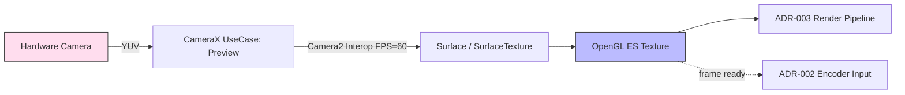

# ADR-001: Camera Capture Pipeline

## 상태
Proposed (HITL L2 대기)

## 컨텍스트
PRD FR-1·5·6과 NFR-1·3·10을 만족하려면 1080p@60fps 안정 캡처가 필요하다.
일반 CameraX `Preview` UseCase는 기본적으로 30fps에 맞춰지며, 60fps 강제 설정이 직접 노출되지 않는다.
Camera2 단독 사용은 60fps 제어가 자유로우나 lifecycle·orientation·error recovery 보일러플레이트가 크다.

## 결정
**CameraX (Preview + ImageAnalysis) + Camera2 Interop 하이브리드**를 채택한다.
- CameraX의 `ProcessCameraProvider` 로 lifecycle·전환·회전 처리
- `Camera2CameraControl` / `Camera2Interop.Extender` 로 다음 캡처 파라미터를 강제:
  - `CONTROL_AE_TARGET_FPS_RANGE = (60, 60)`
  - `CONTROL_AF_MODE = CONTINUOUS_VIDEO`
  - `EDGE_MODE = OFF`, `NOISE_REDUCTION_MODE = FAST` (지연 최소화)
- 캡처 출력은 **`Surface` 1개 (OpenGL ES SurfaceTexture)** 로 통합 — `ImageAnalysis`는 사용하지 않음 (CPU 복사 비용 회피)

## 대안 검토
| 대안 | 장점 | 단점 |
|---|---|---|
| Pure Camera2 | 60fps·노출·포커스 완전 제어 | lifecycle·회전·오류 복구 보일러플레이트, 구현 비용 ↑ |
| Pure CameraX | 단순, lifecycle 자동 | 60fps 강제·정밀 AE 제어 불가, 기기별 편차 |
| **Hybrid (선택)** | CameraX 안정성 + Camera2 정밀도 | 일부 코드가 두 API 혼재 |

## 근거
- 60fps 안정성(NFR-3)은 Camera2 파라미터 제어 필수
- 카메라 전환·회전 안정성(NFR-10)은 CameraX 검증된 lifecycle 의존
- S26 Ultra 같은 플래그십은 1080p@60fps 보장되나, A-3(API 26+ 폴백 기기) 호환은 Camera2 fps 강제로만 가능
- `ImageAnalysis` 미사용으로 NFR-1(60ms M2P) 달성: SurfaceTexture 직접 GPU 입력

## 결과
- **장점**: 60fps 안정 + lifecycle 안전 + GPU 직결로 저지연
- **단점**: 일부 기기(특히 mid-tier)에서 60fps 미지원 → 자동 30fps 폴백 로직 필요 (NFR-3 fallback)
- **위험**: Samsung 카메라 HAL 특이동작 (S26 Ultra) — 별도 device-specific tuning 가능성

## 상호작용 (ADR-002·003 의존)
- 출력 Surface는 ADR-003 GL 파이프라인의 SurfaceTexture로 직접 연결
- 이 SurfaceTexture가 발생시키는 frame 이벤트가 ADR-002 인코더 입력 트리거

## 다이어그램

## 검증 기준
- 1080p@60fps 5분 연속 캡처 시 fps 변동 ≤ 5%
- 전·후면 전환 시 ≤ 500ms (NFR-10)
- M2P latency ≤ 60ms (NFR-1) — `Choreographer` + frame timestamp 측정
