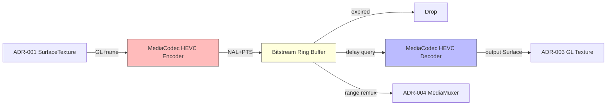

# ADR-002: Frame Buffer Strategy

## 상태
Proposed (HITL L2 대기)

## 컨텍스트
연속 지연 재생(FR-2)·리플레이(FR-7a)·저장(FR-7) 모두 "직전 N초 스트림"을 메모리에 보관해야 한다.
1080p@60fps의 메모리 비용:

| 형태 | 프레임 크기 | 60fps × 60s 총량 |
|---|---|---|
| RGBA8 raw | 8.3 MB | **30 GB** ❌ |
| YUV 4:2:0 raw | 3.1 MB | **11 GB** ❌ |
| H.264 HW (8 Mbps) | ~17 KB/frame 평균 | **60 MB** ✅ |
| HEVC HW (5 Mbps) | ~10 KB/frame 평균 | **38 MB** ✅ |

raw 보관은 NFR-5(2.5GB) 제약을 절대 충족 불가. 압축 인코딩 필수.

## 결정
**HW HEVC(H.265) 인코더를 통한 비트스트림 링버퍼 (Bitstream Ring Buffer)** 채택.
- 입력: ADR-001 SurfaceTexture → `MediaCodec` HEVC 인코더 (Surface 입력 모드)
- 키프레임 간격(GOP) = **0.5초** (30프레임 @ 60fps) — 슬라이더 조작·리플레이 시 빠른 seek
- 인코더 비트레이트: 5 Mbps (1080p HEVC), bitrate-mode VBR
- 링버퍼: NAL 단위 큐 (`ArrayDeque<EncodedSample>`), 각 샘플은 PTS·키프레임 플래그 보유
- 만료 정책: PTS < (now − maxDelaySetting − 0.5s 마진) 이면 폐기. 단, 진행 중 저장이 점유한 범위는 보호.
- 출력: 사용자 설정 delay 만큼 과거 PTS의 키프레임 + 그 이후를 디코더에 공급 (ADR-003)

추가 결정:
- HEVC 미지원 기기는 **H.264 폴백** (런타임 codec 검사)
- 디코더 Output Surface = ADR-003 OpenGL SurfaceTexture (zero-copy)

## 대안 검토
| 대안 | 장점 | 단점 |
|---|---|---|
| GPU 텍스처 풀 (RGBA on GPU) | 디코드 비용 0 | 30GB 필요, VRAM 한계로 불가 |
| Raw YUV in-memory ring | 코덱 의존성 0 | 11GB 필요, NFR-5 위반 |
| Disk 기반 영상 파일 (continuous mp4) | 메모리 절약 | 디스크 I/O 발열·배터리·파일 lifecycle 복잡, 슬라이더 즉시반영 어려움 |
| **HW HEVC 비트스트림 링버퍼 (선택)** | 메모리 ~40MB, S26 Ultra HW 가속 | 인코드/디코드 latency 추가 (~16~33ms) |
| HW H.264 비트스트림 링버퍼 | 호환성 ↑ | 동일 화질 비트레이트 1.6배 → 메모리·발열 ↑ |

## 근거
- NFR-5(2.5GB)·NFR-7(45℃ 표면) 동시 만족하는 유일 구조
- HEVC HW 인코더 latency는 S26 Ultra에서 1프레임(16ms) 이내 — NFR-2(±33ms) 여유
- GOP 0.5초로 슬라이더 변경 시 최대 0.5초 시작점 점프 → 사용자에게 "워밍업" 표시로 흡수
- 비트스트림은 그대로 MP4 remux 가능 → ADR-004 저장 파이프라인과 통합

## 결과
- **장점**: 60초 딜레이 메모리 < 50MB, 발열 최소
- **단점**: 인코드+디코드 양방향 처리 → CPU/HW 부하. 단, S26 Ultra HW 인코더로 흡수 가능
- **위험**: 일부 기기 HEVC 인코더 1080p60 미지원 → H.264 폴백 + UI 경고
- **A-1 해소**: 최대 딜레이 = **60초** (메모리·발열 마진 고려)

## 다이어그램

## 검증 기준
- 60초 딜레이 + 1080p@60fps 5분 연속 시 RSS ≤ 2.5GB
- 슬라이더 변경 후 ≤ 500ms 이내 새 딜레이값 반영
- 인코드+디코드 라운드트립 latency ≤ 33ms (NFR-2)
