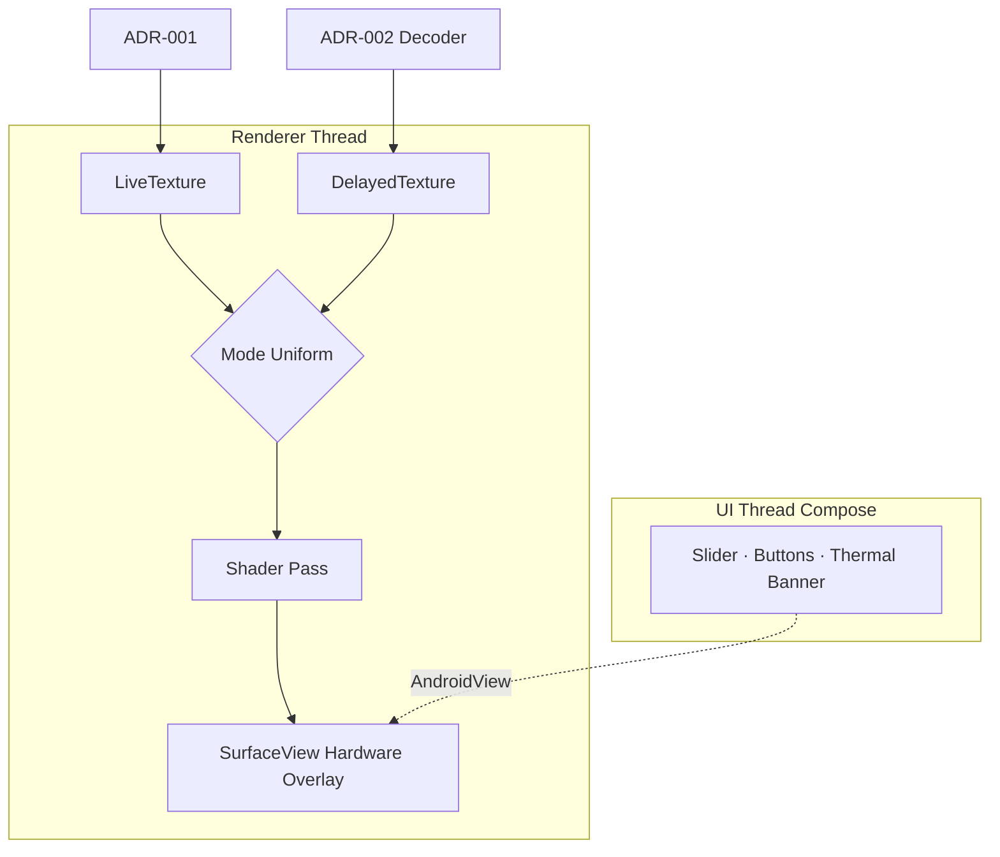

# ADR-003: Render & Display Pipeline

## 상태
Proposed (HITL L2 대기)

## 컨텍스트
캡처(ADR-001)와 디코더(ADR-002)가 모두 GPU 텍스처로 들어오고, 모드(라이브/딜레이/리플레이) 전환 시 무손실로 출력 소스만 바뀌어야 한다.
Compose는 60fps UI에 적합하나 카메라 raw output을 직접 그릴 수 없고, AndroidView로 SurfaceView를 임베드하는 패턴이 표준.

## 결정
**SurfaceView (또는 GLSurfaceView 대용 커스텀) + OpenGL ES 3.0 렌더러** 채택.
- 1개의 출력 SurfaceView가 메인 디스플레이
- 별도 GL 렌더 스레드 1개 + EGLContext 1개
- 입력 텍스처 2개 등록:
  1. `LiveTexture`: ADR-001 카메라 SurfaceTexture
  2. `DelayedTexture`: ADR-002 디코더 출력 SurfaceTexture
- 셰이더 단일 패스(`fullscreen quad`)에서 mode uniform으로 라이브/딜레이/리플레이 선택
- Compose UI는 `AndroidView`로 SurfaceView를 wrap하고, 슬라이더·버튼·발열 경고는 Compose 오버레이

## 대안 검토
| 대안 | 장점 | 단점 |
|---|---|---|
| Pure Compose `Canvas` + Bitmap 변환 | UI 통합 단순 | 60fps 실패 (CPU 변환 과부하) |
| Vulkan 렌더러 | 최고 성능 | API 26+ 호환성 미흡, 코드 복잡도 ↑ |
| TextureView + Canvas | Compose-friendly | hardware overlay 부재로 latency ↑ |
| **SurfaceView + OpenGL ES 3.0 (선택)** | hardware overlay·zero-copy·60fps 확보 | Compose↔SurfaceView 합성 boilerplate |
| ExoPlayer 채용 (delay 모드) | 영상 재생 표준 | 실시간 비트스트림 push API 부재, ring buffer 통합 어려움 |

## 근거
- SurfaceView는 hardware overlay에 직접 합성되어 NFR-1(60ms M2P) 달성 가능
- OpenGL ES 3.0은 `GL_OES_EGL_image_external` 텍스처로 SurfaceTexture를 zero-copy 샘플링 → 가장 저지연
- Compose는 system UI overlay에만 사용 (성능 영향 없음)

## 결과
- **장점**: 60fps 안정, mode 전환은 uniform 1개 변경으로 ≤ 1프레임 내 처리
- **단점**: GL boilerplate (EGL 초기화·컨텍스트 lifecycle), Compose embedding 주의
- **위험**: 화면 회전 시 EGLSurface 재생성 → 짧은 black flash 가능 (NFR-3 영향, 추가 최적화 필요)

## 모드 전환 시맨틱
| 모드 | 셰이더 입력 | 비고 |
|---|---|---|
| LIVE | LiveTexture | M2P 최소화, 디코더 idle |
| DELAYED | DelayedTexture | 워밍업 중에는 LiveTexture를 fade로 폴백 |
| REPLAY | DelayedTexture (1회 시퀀스) | 종료 시 DELAYED 자동 복귀 |

## 다이어그램

## 검증 기준
- 60fps 출력 dropped frame ≤ 1% (NFR-3)
- 모드 전환(LIVE↔DELAYED) ≤ 16ms (1 frame)
- 화면 회전 시 검은 화면 ≤ 200ms
