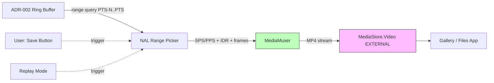

# ADR-004: Recording & Storage Pipeline

## 상태
Proposed (HITL L2 대기)

## 컨텍스트
FR-7(녹화·저장)·FR-7b(리플레이 클립 저장)는 이미 ADR-002 링버퍼에 인코딩된 비트스트림을 활용하면 **재인코딩 없이** 즉시 MP4로 저장 가능하다.
재인코딩은 발열·배터리·시간 모두 손해.

## 결정
**ADR-002 비트스트림 링버퍼의 NAL 시퀀스를 `MediaMuxer`로 MP4 remux** 하는 zero-reencode 저장.
3가지 저장 모드:

| 모드 | 트리거 | 데이터 |
|---|---|---|
| `LAST_N` (기본) | 사용자가 "저장" 버튼 → 최근 N초 (N = 현재 딜레이 길이) | 링버퍼 [now-N .. now] 범위 |
| `MANUAL_RANGE` | 사용자가 "녹화 시작" → "녹화 종료" | 두 시점 사이 범위 (백그라운드 비트스트림 보호) |
| `REPLAY_CLIP` | 리플레이 재생 중 "저장" 버튼 (FR-7b) | 현재 재생 중 N초 범위 |

저장 위치: `MediaStore.Video.Media.EXTERNAL_CONTENT_URI` (Android 10+ Scoped Storage). 폴더: `Movies/DelayCam/`. 파일명: `delaycam_<yyyyMMdd_HHmmss>.mp4`.
컨테이너: MP4. 코덱: 링버퍼와 동일(HEVC 또는 H.264). 오디오 트랙 없음 (MVP).

링버퍼 보호:
- 저장 작업이 점유한 PTS 범위는 GC 만료 우선순위에서 제외 (참조 카운트)
- 저장 완료 시 carbonate

## 대안 검토
| 대안 | 장점 | 단점 |
|---|---|---|
| `MediaRecorder` 별도 인스턴스 | 표준 API | 두 번째 카메라 인스턴스 불가, 인코더 중복으로 발열 ↑ |
| 저장용 별도 인코더 | 분리된 lifecycle | 같은 캡처를 두 번 인코딩 → 발열·배터리 2배 |
| Raw 버퍼 → 저장 시 인코딩 | 화질 자유도 | 메모리 한계로 ADR-002에서 이미 기각 |
| **링버퍼 NAL → MediaMuxer remux (선택)** | 재인코딩 0, 즉시 저장 | 저장 동안 GC 보호 로직 필요 |

## 근거
- NFR-11(저장 실패율 0.1%): MediaMuxer는 단순 컨테이너 작성으로 실패 지점 최소
- NFR-7(45℃): 인코더 1개만 가동
- FR-7b(리플레이 클립 저장): 이미 디코딩 중이지만 원본 NAL은 링버퍼에 보존 → 그대로 remux

## 결과
- **장점**: 저장은 거의 디스크 I/O 한계까지 빠름 (1080p HEVC 5Mbps × 60s = 38MB ≈ 1초 내 완료)
- **단점**: GOP 시작점 정렬 필요 (저장 시작 PTS는 직전 키프레임으로 스냅) → 최대 0.5초 추가 포함
- **위험**: HEVC HW 인코더 SPS/PPS NAL을 별도 추적·삽입 필요. MediaCodec `KEY_OUTPUT_VIDEO_DELAY` 미지원 기기 호환성 검증 필요
- **A-2 해소**: 코덱 HEVC(기본) / H.264(폴백), 컨테이너 MP4

## 다이어그램

## 권한·프라이버시
- API 33+: `READ_MEDIA_VIDEO` 만 선언 (자체 작성 파일 읽기 위함)
- API 28~32: 폴백 `WRITE_EXTERNAL_STORAGE` (legacy)
- API 29+: `MediaStore` API로 권한 없이 자체 앱 폴더 작성 가능 → 가능하면 권한 0 유지
- `INTERNET` permission 미선언 (FR-13, NFR-12)
- 저장 후 EXIF·메타데이터에 위치정보 절대 미포함

## 검증 기준
- 1080p HEVC 60초 클립 저장 ≤ 2초 (S26 Ultra UFS 4.0)
- 저장 실패율 ≤ 0.1% (NFR-11)
- 저장 중 라이브 fps drop ≤ 5%
- MediaStore 등록 후 즉시 갤러리 앱에서 재생 가능
