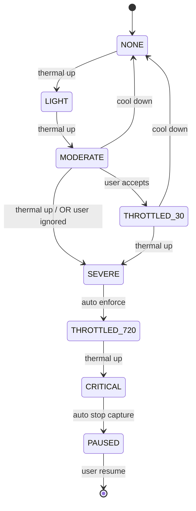

# ADR-005: Thermal Management Policy

## 상태
Proposed (HITL L2 대기)

## 컨텍스트
1080p@60fps 카메라 + HEVC 인코더 + HEVC 디코더 + GL 합성 + MP4 저장은 모두 동시 가동되는 발열 다중원이다.
S26 Ultra라도 30분 연속 사용 시 표면 ≤ 45℃ 보장은 능동적 throttling 필요.
A-5 (자동 다운스케일 vs 사용자 경고만)는 사용자 신뢰와 직결된 결정 — 자동 변경은 사용자가 모르면 "버그"로 인식할 위험.

## 결정
**Adaptive Throttle with User Consent** — 자동 알림 + 명시적 동의 기반 다운스케일.

### 4단계 정책 (`PowerManager.OnThermalStatusChangedListener` 구독)

| Thermal Status | UI 변화 | 자동 액션 | 사용자 액션 |
|---|---|---|---|
| `NONE` / `LIGHT` | 변화 없음 | 없음 | — |
| `MODERATE` | 상단 노란색 배너: "발열 감지. 화질 낮춰 안정성을 높일까요? [예/무시]" | 없음 (대기) | "예" → 1080p@30fps + 비트레이트 4Mbps |
| `SEVERE` | 빨간 배너: "과열 위험. 자동으로 화질을 낮춥니다." | **즉시** 720p@30fps + 비트레이트 2Mbps + 딜레이 cap 30초 | "원래대로" 토글 가능 |
| `CRITICAL` / `EMERGENCY` | 모달 다이얼로그: "기기 과열로 일시 정지됩니다." | 캡처·인코더·디코더 즉시 정지, 라이브 정적 화면 표시 | 사용자 명시 재개만 가능 |
| `SHUTDOWN` | (도달 전 저지) | 5초 후 강제 종료 + 미저장 분 폐기 | — |

### 추가 보호장치
- **Idle Auto-Pause**: 5분간 사용자 입력 없으면 fps를 30으로 자동 강하 (별도 발열원 차단)
- **딜레이 Cap**: 현재 thermal status에 따라 슬라이더 최대값 동적 변경 (60→30→10초)
- **저장 우선권**: SEVERE 진입해도 진행 중 저장 작업은 완료까지 보장 (사용자 데이터 손실 방지)

## 대안 검토
| 대안 | 장점 | 단점 |
|---|---|---|
| 자동 다운스케일만 (Silent) | UX 단순 | 사용자 모르게 화질 변화 → 신뢰 저하 |
| 경고만 + 수동 변경 | 사용자 통제권 ↑ | CRITICAL 도달 시 대응 늦음 |
| **MODERATE는 동의·SEVERE는 자동 (선택)** | 사용자 통제 + 안전 마진 | 정책 복잡도 ↑ |
| 발열 무시 | 구현 간단 | NFR-6·7 위반 |

## 근거
- MODERATE 단계는 회복 가능 → 사용자에게 선택권 (자율성)
- SEVERE 단계는 회복 어려움·기기 보호 필요 → 자동 강제 (안전성 우선)
- CRITICAL은 OS-level 강제 종료 위험 → 우리가 먼저 안전하게 정지

## 결과
- **장점**: 사용자 신뢰 + 안전 모두 확보, NFR-6·7 만족
- **단점**: thermal listener API는 API 29(Android 10) 이상 → API 26~28은 단순 timer 기반 폴백
- **위험**: thermal API 보고가 기기마다 calibration 차이. S26 Ultra에서 calibration 후 다른 기기에서 false positive 가능
- **A-5 해소**: 정책 4단계 위 표대로 확정

## 다이어그램

## 검증 기준
- 25℃ 환경 30분 연속 1080p@60fps 사용 시 SEVERE 미진입 (NFR-6)
- 표면 온도 ≤ 45℃ (NFR-7, 별도 측정 SOP)
- MODERATE 진입 후 사용자 액션 없으면 체감 변화 없음 (자동 변경 금지)
- SEVERE 진입 5초 이내 자동 다운스케일 적용
- CRITICAL → 캡처 정지까지 ≤ 1초
