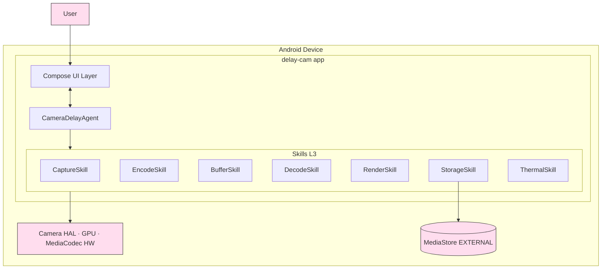
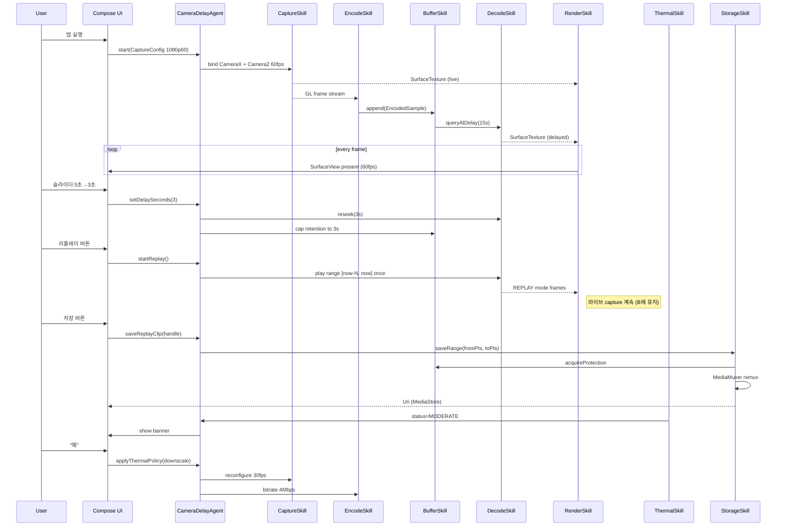
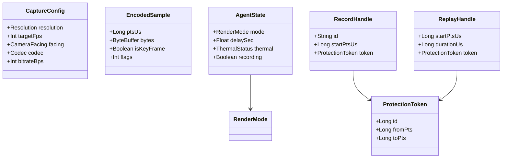

# Design — Delay Camera

## 1. 패턴 선택
- **데이터 흐름**: 파이프라인 (Camera → Encoder → RingBuffer → Decoder → Renderer → Display)
- **컴포넌트 라이프사이클**: Supervisor (`CameraDelayAgent`가 5개 Skill의 시작·정지·전환 조율)
- 근거: PRD 요구는 "동시 다중 단계 변환"이며 각 단계가 명확히 순차 의존 → 파이프라인 패턴이 자연스럽고 디버깅·교체 용이.

## 2. 시스템 컨텍스트



## 3. Layer 매핑 (CLAUDE.md 합의)

| Layer | 구성요소 | 책임 |
|---|---|---|
| L1 UI | `MainActivity` (Compose) · `DelaySliderScreen` · `ThermalBanner` · `ReplayButton` · `SaveButton` | 사용자 입력 수집·상태 표시 |
| L2 Agent/Service | `CameraDelayAgent` (Foreground Service) | 7 Skill의 lifecycle·전환·오류 복구 조율 |
| L3 Skills | `CaptureSkill`·`EncodeSkill`·`BufferSkill`·`DecodeSkill`·`RenderSkill`·`StorageSkill`·`ThermalSkill` | 단일 책임 단위 (테스트 가능) |
| L4 Data | `EncodedSample` (NAL+PTS) · `BufferState` · `RenderMode` | 메모리 내 모델 |
| L5 Infra | CameraX·Camera2·MediaCodec·MediaMuxer·OpenGL ES·MediaStore·PowerManager | Android 플랫폼 |

## 4. 컴포넌트·인터페이스

### 4.1 `CameraDelayAgent` (L2)
```kotlin
class CameraDelayAgent(context: Context, scope: CoroutineScope) {
    val state: StateFlow<AgentState>
    fun start(config: CaptureConfig)
    fun stop()
    fun setDelaySeconds(seconds: Float)        // FR-3 (0.0..maxAllowed)
    fun setMode(mode: RenderMode)              // FR-4 (LIVE/DELAYED)
    fun switchCamera()                         // FR-5
    fun startReplay(): ReplayHandle            // FR-7a — 현재 delay만큼 재생
    fun saveLastN(): SaveJob                   // FR-7 LAST_N
    fun startManualRecording(): RecordHandle   // FR-7 MANUAL_RANGE
    fun saveReplayClip(handle: ReplayHandle)   // FR-7b
    fun applyThermalPolicy(status: ThermalStatus)  // FR-14 / ADR-005
}

sealed interface RenderMode {
    object LIVE : RenderMode
    object DELAYED : RenderMode
    data class REPLAY(val startPtsUs: Long, val durationUs: Long) : RenderMode
}
```

### 4.2 `BufferSkill` (L3, 핵심)
```kotlin
interface BufferSkill {
    fun append(sample: EncodedSample)                       // EncodeSkill 호출
    fun queryRange(fromPtsUs: Long, toPtsUs: Long): Sequence<EncodedSample>
    fun queryAtDelay(delayUs: Long): EncodedSample?         // 디코더 입력
    fun acquireProtection(fromPtsUs: Long, toPtsUs: Long): ProtectionToken
    fun release(token: ProtectionToken)
    val approxBytesInMemory: Long
}

data class EncodedSample(
    val ptsUs: Long,
    val bytes: ByteBuffer,
    val isKeyFrame: Boolean,
    val flags: Int
)
```
구현: `ConcurrentLinkedDeque<EncodedSample>` + 만료 GC 코루틴 + 참조카운트 보호 맵.

### 4.3 `RenderSkill` (L3)
```kotlin
interface RenderSkill {
    fun attachLiveSurface(): Surface          // 카메라 입력
    fun attachDelayedSurface(): Surface       // 디코더 입력
    fun setMode(mode: RenderMode)
    fun setMirror(enabled: Boolean)           // FR-15
    fun snapshot(): Bitmap?                   // 디버그 도구용
}
```
GLThread 1개, EGLContext 1개, fullscreen-quad 셰이더.

### 4.4 `StorageSkill` (L3)
```kotlin
interface StorageSkill {
    suspend fun saveLastN(durationSec: Int): Result<Uri>
    suspend fun startManualRecording(): RecordHandle
    suspend fun stopManualRecording(handle: RecordHandle): Result<Uri>
    suspend fun saveRange(fromPtsUs: Long, toPtsUs: Long): Result<Uri>
}
```
내부: BufferSkill 보호 토큰 → NAL 시퀀스 → MediaMuxer → MediaStore URI 반환.

### 4.5 `ThermalSkill` (L3)
```kotlin
interface ThermalSkill {
    val status: StateFlow<ThermalStatus>
    fun onUserConsent(action: ThermalAction)
}

enum class ThermalAction { ACCEPT_DOWNSCALE, IGNORE_WARNING, RESUME_FROM_PAUSE }
```
`PowerManager.addThermalStatusListener` 구독 → 상태 머신(ADR-005) 실행.

## 5. End-to-End 데이터 흐름



## 6. 데이터 모델



## 7. 모듈 구조 (Gradle)

```
app/
├── src/main/
│   ├── java/com/delaycam/
│   │   ├── ui/                    # Compose 화면 (L1)
│   │   ├── agent/                 # CameraDelayAgent (L2)
│   │   ├── skills/
│   │   │   ├── capture/           # CaptureSkill (CameraX+Camera2)
│   │   │   ├── codec/             # Encode/DecodeSkill (MediaCodec)
│   │   │   ├── buffer/            # BufferSkill (ring buffer)
│   │   │   ├── render/            # RenderSkill (OpenGL ES)
│   │   │   ├── storage/           # StorageSkill (MediaMuxer)
│   │   │   └── thermal/           # ThermalSkill
│   │   └── data/                  # 데이터 모델 (L4)
│   ├── res/
│   └── AndroidManifest.xml        # CAMERA + READ_MEDIA_VIDEO 만
├── src/test/                      # 단위 테스트 (Robolectric 가능)
└── src/androidTest/               # instrumentation (실기기 fps·m2p 측정)
```

## 8. NFR 매핑 검증

| NFR | 충족 메커니즘 |
|---|---|
| NFR-1 (M2P ≤ 60ms) | SurfaceTexture zero-copy + hardware overlay (ADR-001/003) |
| NFR-2 (딜레이 ±33ms) | PTS 기반 query, GOP 0.5s (ADR-002) |
| NFR-3 (60fps drop ≤ 1%) | GL 단일 패스 + HW 인코더 (ADR-002/003) |
| NFR-5 (RSS ≤ 2.5GB) | HEVC 비트스트림 링버퍼 (ADR-002) |
| NFR-6/7 (발열) | 4단계 thermal 정책 (ADR-005) |
| NFR-9 (콜드 스타트 ≤ 1s) | CameraX bindToLifecycle 사전 prebind |
| NFR-11 (저장 실패율 ≤ 0.1%) | remux only, 인코딩 재실행 없음 (ADR-004) |
| NFR-12 (네트워크 0) | `INTERNET` 미선언 + 의존성 lint |
| NFR-13 (권한 최소) | CAMERA + 미디어만 |
| NFR-16 (minSdk 26) | A-3 해소 |
| NFR-17 (프라이버시) | 휘발성 메모리·명시 액션 시만 저장 |

## 9. 주요 위험 / 미해결

| 위험 | 영향 | 대응 |
|---|---|---|
| HEVC 1080p60 미지원 기기 | 호환성 ↓ | 런타임 codec 검사 → H.264 폴백 |
| Samsung HAL 특이동작 | fps 불안정 | 기기별 tuning matrix (Story 단계) |
| 화면 회전 시 EGL 재생성 black flash | UX | offscreen FBO 임시 표시 |
| 백그라운드 진입 시 카메라 lifecycle | 데이터 손실 | Foreground Service + onStop pause 정책 |

## 10. 변경 이력
| 날짜 | 변경 | 사유 |
|---|---|---|
| 2026-04-30 | 초안 v0.1 | DELAYCAM-001 PRD v0.3.0 → ADR-001~005 → 통합 Design |
